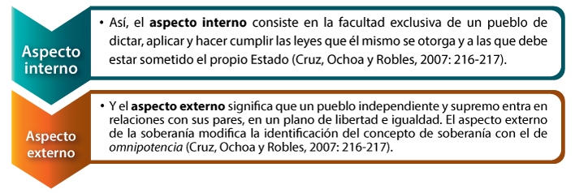
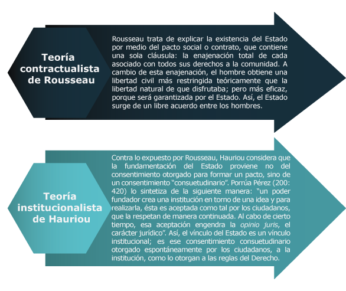

# Los Fundamentos de la Teoría Política

## Introducción

------

Todo **estudio** debe seguir un **método**, el cual está definido de acuerdo al **objeto** que se pretende analizar. El estudio del **Estado** comienza con la delimitación de su amplio marco de análisis y de las disciplinas que se ocupan de su estudio, mismas que de igual forma se encuentran en el apartado de las ciencias sociales.

El **Estado** es una **institución** de las ciencias sociales, a este grupo de ciencias, pertenecen el **derecho** y la **política**, las cuales son las dos **fuentes doctrinarias** del Estado, por una parte como una institución que da fundamento a los sistemas jurídicos contemporáneos (derecho) y, por otra, la forma de organización política de la población (política).

En esta unidad revisaremos los principales elementos teóricos para entender al **Estado** como objeto del conocimiento, naturaleza, manifestaciones, características en diversos grados. De esta forma, con base en la **teoría política** y en sus distintos métodos para la obtención del **conocimiento político**, dilucidaremos el nombre y las diversas concepciones del fenómeno Estado, así como sus vínculos con la ciencia del **derecho**.

Será necesario, entonces, realizar nuestro análisis de la **ciencia política** bajo la idea de ser el arte de gobernar y con ello la necesidad de la **institución** del **Estado** como mecanismo de desarrollo de esta actividad.

Es por esto que el estudio de esta unidad representa una base doctrinaria en la formación de los estudiantes de la Licenciatura en Derecho, ya que una de sus actividades profesionales está encaminada al análisis de los fenómenos en sociedad a través del **marco normativo** establecido por el **Estado**, y a su posterior **regulación**, con el fin de establecer reglas de orden para una **vida social en armonía**.

 

 

(1) *Estado*

 

#   Actividad Introductoria

------

**Definición de Estado, derecho y política**
Ejercicio de opción múltiple sobre disciplinas que estudian el derecho

Pulse en el botón **Iniciar** para realizar su **actividad introductoria**

 

## Objetivo

------

A lo largo de esta unidad, usted:

Explicará el marco teórico necesario para describir el fenómeno político del Estado.

>  

### Temario

------

**Unidad 1. Los fundamentos de la teoría política**

- 1.1. 

  El Estado como objeto de conocimiento

  - **1.1.1.** La realidad del Estado y el conocimiento del Estado
  - **1.1.2.** El conocimiento: su naturaleza, sus manifestaciones, sus diversos grados
  - **1.1.3.** El conocimiento aplicado al Estado
  - **1.1.4.** Características de todo conocimiento científico del Estado
  - **1.1.5.** Problemas esenciales que plantea

- 1.2.

   

  Las disciplinas que se ocupan del estudio del Estado

  - **1.2.1.** La política y la teoría política
  - **1.2.2.** Unidad de la teoría política y multiplicidad de las ciencias políticas
  - **1.2.3.** Las disciplinas políticas fundamentales, especiales y auxiliares
  - **1.2.4.** La política aplicada
  - **1.2.5.** La política y lo político

- 1.3.

   

  Funciones de la teoría política

  - **1.3.1.** Función de la teoría política
  - **1.3.2.** Criterios para apreciar la validez de las afirmaciones de la teoría política
  - **1.3.3.** La teoría política dogmática y la teoría política crítica
  - **1.3.4.** Crisis y reconstrucción de una auténtica teoría política

- 1.4.

   

  El método en el conocimiento político

  - **1.4.1.** Planteamiento e importancia del problema del método en el conocimiento político
  - **1.4.2.** Las características peculiares de la metodología política
  - **1.4.3.** Supuestos en que ha de basarse la metodología política
  - **1.4.4.** Pluralidad de métodos en el conocimiento político y unidad de la realidad
  - **1.4.5.** Métodos propios de la teoría política

- 1.5.

   

  Nombre y concepto de

   

  Estado

  - **1.5.1.** Los nombres de la comunidad política a lo largo de la historia
  - **1.5.2.** Los diversos significados de la palabra Estado
  - **1.5.3.** Del nombre del Estado al concepto del Estado
  - **1.5.4.** Concepto social y concepto jurídico del Estado
  - **1.5.5.** Definición nominal y conceptual del Estado

- 1.6.

   

  Diversas concepciones del Estado

  - **1.6.1.** Distintos puntos de vista desde los cuales puede considerarse al Estado
  - **1.6.2.** Concepciones predominantemente objetivas del Estado
  - **1.6.3.** Concepciones predominantemente subjetivas del Estado
  - **1.6.4.** Concepciones jurídicas del Estado

- **1.7.** Estado y derecho

- - **1.7.1.** El Estado y el derecho: el problema de sus mutuas relacione
  - **1.7.2.** Soluciones al problema: posiciones contemporáneas
  - **1.7.3.** El poder y el derecho en la concepción institucional del Estado
  - **1.7.4.** El Estado de derecho: fórmulas de conciliación e integración

 Desarrollo de contenido

------

**El Estado como objeto de conocimiento**

**Reflexión**

¿Qué es el Estado? ¿Cuál es su forma? ¿Para qué existe? ¿Dónde se encuentra?

Son las interrogantes naturales que deben surgir al introducirnos en esta materia. Plantear las respuestas, lleva implícito un interés que debe internarnos a disciplinas determinadas dentro de la ciencia política y el derecho.

Satisfacer nuestra curiosidad exige indagar en la teoría política (¿qué es el Estado?), en el Derecho (¿para qué existe el Estado?), ya que es evidente que el hombre tiene que obedecer la ley intentando conservar su libertad.

Al enunciar al Estado nos damos cuenta de que existe algo en la realidad a lo que se ajusta esa denominación, es decir, sentimos la presencia del Estado como algo que se encuentra en nuestra vida social en actividades como las señaladas enseguida:

a) Expedición de ordenamientos jurídicos para regular la vida social del hombre.

b) Prestación de servicios públicos a la sociedad: educación, salud, vivienda, alumbrado, limpia, policía, justicia, etcétera.

c) Renovación de funcionarios de la administración pública (federal, estatal y municipal).

 d) Visitas de jefes de Estado y de gobierno, nacionales o extranjeros.

e) Regulación de la vida pública y privada de los ciudadanos, mediante el pago de impuestos, requisitos legales para votar y ser votado en cargos de elección popular, expedición de licencias y permisos para ejercer una determinada profesión, contraer matrimonio, suscribir contratos, etcétera.

(2) *Expedición de ordenamientos jurídicos*

 

Por lo anterior, la delimitación de la realidad y el conocimiento del Estado implican tener presente la diferenciación de los universos **público** y **privado**, pues el **Estado** va a **regular** y estar presente en ambos ámbitos.

**Nota jurídica**

De hecho, la diferencia original entre público y privado es afirmada por supremacía del primero sobre el segundo, como lo prueba uno de los principios fundamentales que establece que el derecho público no puede ser modificado por pactos entre privados, o una convención entre privados no deroga el derecho público.

 

Así, "**lo público"** alude a lo que es de interés o utilidad **común a todos**, lo que atañe al colectivo, lo que concierne a la comunidad, en oposición a **"lo privado"**, entendido como aquello que se refiere a la utilidad e **interés individual** (Cruz, Ochoa y Robles, 2007: 4-5).

Bien, esto lo sabemos gracias a la construcción del conocimiento acerca del Estado como objeto de estudio, pero ¿qué es *conocimiento*? Veamos un poco acerca de dicho concepto, para después revisar las clases de conocimiento que tiene el Estado. Cruz, Ochoa y Robles, señalan que:

Cruz, Ocha y Robles

El conocimiento es un proceso histórico-social sin el cual el ser humano no podría apropiarse de la naturaleza, interpretarla y transformarla" (2007: 6).

 Además…

Conocimiento

Proviene del griego gnosis, que significa tratado o teoría de conocimiento, a su vez, conocer es averiguar por el ejercicio de las facultades intelectuales, la naturaleza, cualidades y relaciones de las cosas. El ser humano, en su relación con la naturaleza y gracias a su práctica histórico-social, se apropia de ella de diferentes formas" (2007: 6).

 

Es así que del Estado podemos tener diversas clases de conocimientos: vulgar, de divulgación, científico y filosófico. En el caso de nuestra materia, nos interesa adoptar el conocimiento científico, que “se caracteriza por buscar la verdad que se pueda comprobar y alcanzar en un tiempo y lugar determinados, de acuerdo con una metodología disponible y confiable, pero aceptando que dicha verdad pueda ser superada, complementada y corregida cuando se tengan otras experiencias o mejores técnicas metodológicas de investigación” (Cruz, Ochoa y Robles, 2007: 12).

**¡Importante!**

El conocimiento científico del Estado plantea diversos problemas para comprender su estructura: su naturaleza, su organización y funcionamiento, su función social, su justificación y su finalidad.

**Las disciplinas que se ocupan del estudio del Estado**

Para entender al Estado desde un punto de vista del conocimiento científico, existen varias disciplinas que se encargan de estudiarlo y a continuación nos referiremos a ellas.

La política ha existido siempre porque donde existen los hombres existe la sociedad y donde existe una sociedad resulta indispensable que exista una organización, fruto de ella misma, de decisiones vinculantes. De ahí que Aristóteles conceptualizara al hombre como un *zoonpolitikón* ("animal político") y con ello expresara la concepción griega de la vida, es decir, la manera como calificaba al ciudadano griego de esa época que vivía en sociedad, una concepción que hacía de la polis la unidad constitutiva y la dimensión completa de la existencia humana.

Así, debe señalarse que la política se encuentra en todos los ámbitos de la vida económica, social y cultural, en el dominio de lo público y de lo privado, que entraña enfrentamiento y colaboración entre los individuos por la adquisición del poder, además de que refleja la estructura de la sociedad. En este sentido, podemos decir que la ciencia política es:

**Definamos**

**Ciencia política** “es la disciplina que estudia, mediante un método científico, los fenómenos referidos al poder político, al Estado y a las relaciones que se establecen entre éste y la sociedad, así como a las formas de organización y representaciones políticas” (Cruz, Ochoa y Robles, 2007: 20).

 

La ciencia política, para su mejor estudio análisis y reflexión de los fenómenos políticos, se divide en ramas y subramas de disciplinas políticas fundamentales, especiales y auxiliares.

 Pulse en cada uno de los conceptos que aparecen del lado izquierdo para desplegar la información correspondiente.

 

Fundamentales

- Estudian diversos aspectos de los hechos políticos.
- Son filosofía política, historia política y ciencia política

Especiales

- Se ocupan de aspectos parciales del Estado.
- Algunas forman parte de la teoría del Estado como la teoría de las formas de gobierno o la teoría de la Constitución.
- Otras estudian algunos componentes del Estado como el derecho político, la economía política, la sociología política o la pedagogía política.

Auxiliares

- Estudian algunos de los elementos integrantes del Estado.
- La población: ciencias como la sociología, etnografía o estadística.
- El territorio: ciencias como la geografía o geología.
- El orden jurídico: ciencias como el derecho, la ética o la filosofía.

La **política aplicada** se refiere a los puntos de vista adoptados por el Estado frente a los diversos problemas sociales que enfrenta y que implican la adopción de determinadas decisiones. Así, puede hablarse de política **económica**, política **social**, política **internacional**, políticas **públicas**, etcétera.

**¡Importante!**

En un concepto amplio, *la política* y *lo político* se vinculan a todo tipo de poder organizado, en donde las actividades humanas están perfectamente delimitadas de mando y obediencia, de autoridad y de consentimiento, etcétera. *Lo político* nos remite a los conflictos emanados del sistema de diferencias inherentes a una sociedad, y *la política* denota el sistema institucional que se produce en cada orden social para controlar los conflictos, así como las acciones cuyo sentido depende o remite a dicho sistema**.**

 

**Funciones de la teoría política**

Nos preguntamos entonces, ¿para qué sirve la **teoría política**? ¿Qué aplicación tiene en el estudio del Estado?

Al igual que otras disciplinas sociales, la teoría política ha tenido un desarrollo histórico y como disciplina tiene sus orígenes en el mundo antiguo clásico y un amplio desarrollo durante el siglo XIX, en el que el pensamiento y la reflexión teórica se caracterizaban por el descubrimiento de conceptos éticos y su aplicación en las relaciones sociales y prácticas políticas. La teoría política se identifica, desde los comienzos de su **elaboración sistemática**, con un tipo de **reflexión sobre lo político** marcada predominantemente por las teorías empíricas, históricas y normativas.

Para apreciar la validez de las afirmaciones de la teoría política, debemos reconocer que no todo conocimiento puede considerarse científico, sino sólo el que reúne los requisitos siguientes: objetivo, analítico, claro y preciso, verificable, metódico, sistemático y explicativo.

Así, podemos decir que una teoría política tendría que ser una 

reflexión congruente

, 

lógica

 y 

sistemática

 que busca la explicación, comprensión y descripción de la realidad política a través de un conjunto de proposiciones relacionadas entre sí y que conformen una red conceptual coherente.

 **El método en el conocimiento político**

Al decir que la **teoría política** es una **reflexión congruente lógica y sistemática**, es inevitable remitirnos al concepto de **metodología**. Y al hablar de metodología, algunos científicos de las ciencias naturales y sociales hacen referencia a la **aplicación del método**, y utilizan ambos términos en forma sinónima. Sin embargo, el método constituye el objeto de estudio de la metodología, y una rama de ésta es la metodología política.

 

**Definamos**

Entendemos al **método** como una sucesión de pasos encaminados y ligados entre sí que buscan un fin determinado. Y **el método científico** “es la actividad científica deliberada y reflexiva para conseguir el conocimiento de la naturaleza y de la sociedad” (Cruz, Ochoa y Robles, 2007: 38).

 

El **método científico** está compuesto por los siguientes componentes del proceso de forma general:

 

 

La metodología puede comprenderse como la ciencia del método, que hace un estudio crítico del mismo. Así, la metodología política puede definirse como “una disciplina social que estudia la aplicación de los métodos de conocimiento a los diferentes ámbitos de la política, o también que es una rama o derivación de la metodología en general (estudio de los métodos), cuyo campo de aplicación se restringe a la política” (Cruz, Ochoa y Robles, 2007: 42).

Entonces, la metodología política, al tener características muy particulares, se basa en tres supuestos, según Héctor González Uribe (1992: 110):

 Pulse en cada uno de los conceptos que aparecen del lado izquierdo para desplegar la información correspondiente.

 

Metafísico

Implica una investigación tendiente a localizar al Estado en el mundo del *ser*.

 

Gnoseológico

Busca el modo de conocimiento que mejor se adapte a la realidad estatal.

 

Lógico

Tratan de ubicar el conocimiento político en el dominio de las ciencias.

 

 

Existen múltiples métodos que la ciencia política utiliza para analizar su objeto de estudio. Tantos métodos como profundas diferencias existen entre los politólogos para analizar los fenómenos políticos. Derivado de esto, la ciencia política se auxilia de diversos métodos, entre los que destacan: la teoría normativa, el institucionalismo, el conductismo, la elección racional, el feminismo y el análisis de discurso.

 

 

**Nombre y concepto de Estado**

Siendo el Estado el concepto en el que centra su estudio la ciencia política, es tiempo de referirnos a él y comenzaremos por definirlo.

El concepto **Estado** ha tenido una evolución y transformación a lo largo de la historia y para entenderlo y configurarlo como lo entendemos actualmente, es necesario revisar los nombres que ha tenido y que recogen Cruz, Ochoa y Robles (2007: 52-53):

Societas, *gens*, tribu

- Modo asiático de producción comunal social.

- Se usó en el mundo antiguo (Mesopotamia, Persia, Egipto, China y Mesoamérica).

Polis o ciudad-estado to–koinón o comunidad

- Esta acepción pertece a la Grecia clásica (Esparta y Atenas, 480-404 a. C.)

Civitas, Regnum (reino), Res publica, Imperium

- Conceptos usados desde el Imperio Romano de Occidente (753 a. C.-476 d. C.) hasta el Imperio Romano de Oriente (476 d. C.-1453).

Land (tierra), Status rei publicae, Status publicus, Imperium, República, Commonwealth

- Conceptos usados durante la Edad Moderna (1453-Revolución francesa de 1789)

Estado, Estado-nación, Estado multinacional, país, pueblo, potencias, sociedad, aldea global, sistema-mundo, estado multicultural

- Conceptos surgidos en la Edad Contemporánea (desde 1789 hasta nuestros días).

Los mismos autores indican que, etimológicamente, *“Estado* deriva de *status*, que era la palabra empleada en Roma para caracterizar la situación jurídica en que se encontraba una persona; así era el conjunto de sus derechos y obligaciones, ya sea respecto a la ciudad política (*status civitatis*), a la libertad (*status libertatis*), o a su familia (*status familiae*)” (Cruz, Ochoa y Robles, 2007: 57).

Sin embargo, un significado más preciso de la palabra *estatus* o Estado sólo comienza a perfilarse cuando se emplea para designar así a la **organización** **política de la sociedad**, es decir, la manera de ser o estar constituida. La **naturaleza** del Estado se puede estudiar en dos aspectos: **formal** y **material**.

Material

El aspecto material del Estado se refiere a su contenido, a los datos reales, que es una esencia.

Formal

El aspecto formal se refiere a su estructura y a sus componentes, que es la universalidad .

 

**¡Importante!**

El **concepto social** del Estado tiene que ver con la suma de las relaciones sociales que se dan entre los hombres, que lo conciben como una creación humana eminentemente social y que existen junto al hombre.

El

 

concepto jurídico

 

se establece cuanto el Estado se somete o autolimita al sistema jurídico que le da estructura, funciones y limitaciones, a la vez que se convierte en sujeto de derechos y obligaciones.

 

Una definición nominal del **Estado** es aquella que describe sus notas y características esenciales. Por ello, el Estado es definido por Héctor González Uribe de acuerdo con cada uno de sus elementos (1992: 162):

- Una sociedad humana.
- Establecida permanentemente en un territorio.
- Regida por un poder soberano.
- Que se rige con un ordenamiento jurídico.
- Tiene por objeto realizar los valores individuales y sociales de la persona humana, también conocidos como bien público tempo.

Por otra parte, siguiendo al autor español Adolfo Posada (citado por Cruz, Ochoa y Robles, 2007: 61-62), distinguimos dos clases de elementos del Estado:

Elementos externos y visible*s*, constituidos como entidad a saber:

1. Territorio.
2. Población.
3. Gobierno.

Elementos internos e invisibles –espirituales e íntimos–, de fondo esenciales:

1. Relación de obediencia o de acomodamiento.
2. La norma en que ha de producirse dicha relación.
3. El contenido vital impulsor de la relación y de su norma.

**Diversas concepciones del Estado**

Vemos entonces que son múltiples las maneras de concebir al Estado. Y por ello el teórico alemán Georg Jellinek establece que los puntos de vista desde los cuales se puede considerar al Estado son el objetivo o exterior, el subjetivo o psíquico y el jurídico, los cuales no son opuestos entre sí, sino que se complementan y aclaran, y tienden a darnos una visión científica completa del Estado (2000: 159-161). Veamos más de ello en el siguiente recurso.

La **concepción objetiva** del Estado lo considera como una realidad, un ser exterior que existe en forma objetiva, un conjunto de relaciones y acciones sociales que se desenvuelven en un tiempo y lugar determinados.

La **concepción subjetiva** del Estado concibe a éste como un organismo ético-espiritual (un todo orgánico dotado de una vida espacial y con funciones múltiples y variadas) o como una unidad colectiva o de hombres asociados.

Las **concepciones jurídicas** del Estado entienden a éste como objeto de Derecho (el Estado es una cosa que puede ser objeto de disposición o apropiación), como una relación jurídica (relación de dominación entre gobernantes y gobernados) o como sujeto de Derecho (el ser sujeto de derechos y de obligaciones derivados de un ordenamiento jurídico).

**Estado y derecho**

Al referirnos a la mencionada **concepción jurídica del Estado**, debemos establecer las relaciones que se dan entre *Estado* y *derecho*, que son conceptos conjugados y que no pueden concebirse el uno separado del otro. Dicha conexión se acentúa aún más con la aparición del Estado moderno en cuanto institución que monopoliza el uso legítimo de la fuerza física.

Así, muchos estudiosos de la filosofía política y de la filosofía del derecho han planteado las relaciones que se dan entre derecho y Estado. Edgar Bodenheimer (1979: 70-75) menciona tres tipos de teorías:

Teorías que dicen que el **Estado** se encuentra**por encima** del **derecho** y es **superior** a él. Su principal exponente es John Austin, quien afirmaba que el derecho no es otra cosa sino el mandato del soberano.

Teorías que tratan de establecer y demostrar la **superioridad del derecho sobre el poder del Estado**. Sus principales exponentes son Grocio, Pufendorf, Locke y Wolf, quienes opinaban que existen normas eternas de derecho y justicia, siendo éstas superiores a los gobernantes de los Estados y obligatorias para ellos.

Teorías **que niegan la validez del antagonismo entre soberanía del Estado y soberanía del Derecho**. Sus máximos desarrolladores son Vinogradoff, Bentley y Hans Kelsen. Este último opinaba que derecho y Estado son idénticos, ya que todo acto de Estado es un acto jurídico a la vez que toda definición del Estado es una definición del derecho.

La relación entre derecho y Estado implica referirse a las **relaciones entre derecho y poder.**

El fenómeno del **poder**, al ser universal, y analizado por la experiencia histórica, ha sido un concepto clave tanto en las ciencias naturales como en las ciencias sociales, entre ellas la ciencia política y el derecho.

Una de las formas de poder es el **poder político**, que detenta los medios de coacción física.

La posibilidad de que el poder político recurra a la fuerza o a la violencia y sea un elemento distinto respecto de otras formas de poderes (económico, ideológico, etcétera), no quiere decir que el poder político se resuelva en el uso de la fuerza, pues ejercerlo de esa manera, es una condición necesaria pero no suficiente para su existencia.

Es importante señalar que el poder político (como cualquier otro poder) no podrá ser duradero si le falta la **legitimidad** y la **legalidad** que emanan de un **ordenamiento jurídico**, es decir, el **título del poder** y el **ejercicio del poder**. Para que el poder sea válido debe ser justificado. La justificación transforma una relación de mera fuerza en una **relación jurídica**. Ninguna fuerza puede constituirse en un poder legítimo si no cuenta con el consenso libre y voluntario de quienes se someten a ella. Así pues, el único principio válido de legitimidad del poder político es el **consenso**.

La diferencia entre el gobierno de los hombres y el gobierno de las leyes es el fundamento de la identificación de la ley con la razón, que es el principio y el fin del derecho natural en las teorías jurídicas y política de la antigüedad hasta el **Estado de derecho** que hoy se ha apropiado del **discurso democrático**.

Por ello, y como señalan Cruz, Ochoa y Robles, la expresión **Estado de derecho**

“es una de las instituciones más afortunadas y acertadas de la ciencia jurídica y la ciencia política contemporánea al indicar un *valor*, que es la eliminación de la arbitrariedad en el ámbito de la actividad estatal que afecta a los ciudadanos y una *dirección* de desarrollo de la organización del Estado respecto al derecho. Pero, si bien es cierto que implica el cumplimiento de determinadas obligaciones para los gobernantes, también implica que los ciudadanos respeten esas libertades y derechos de los demás, así como consecuentes comportamientos en el marco de los cauces institucionales y constitucionales legítimos entendidos de la manera más amplia y flexible posible” (Cruz, Ochoa y Robles, 2007: 82).

# La historia de la teoría política

## Introducción

------

La historia de la humanidad ha sido marcada por la **organización política de la población** con el objetivo de un bien común; esta idea es la base para el desarrollo de la institución del Estado influenciado por un sinfín de factores que, dieron las características a los diferentes **tipos de estados** que conocemos.

Así, la concepción de Estado ha variado significativamente a lo largo de los siglos, dando como resultado múltiples interpretaciones sobre sus características y funciones. Desde las aportaciones clásicas y liberales del Estado, a las contribuciones marxistas y aquellas teorías que se pronuncian en la actualidad a favor de la desestatización de la política, pasando por los defensores realistas y críticos del Estado social. Es así como el fenómeno estatal ha sido objeto de un análisis intenso en la medida que también se ha transformado.

Partimos el estudio de esta unidad, revisando las primeras civilizaciones que tomaron como factor principal para su organización social, el medio geográfico en que se encontraban asentadas, ya que una de sus principales metas era la de sobrevivir a las inclemencias naturales. Posteriormente, los griegos, bajo las ideas de Aristóteles y Platón, comienzan a construir los cimientos doctrinarios de **la política** y de la forma de organización del **gobierno**. Estas primeras corrientes políticas fueron tomadas nuevamente en consideración durante la Edad Media, bajo la premisa de un cambio en la vida social de la población.

Como consecuencia del cambio gestado en la Edad Media, nacieron los estados absolutistas, los cuales doctrinariamente están dotados de gobernabilidad, pero carentes de un interés general. Sin embargo, la humanidad no tardó mucho en observar el nuevo rumbo de la organización política de la sociedad bajo principios de igualdad y la creación de un **sistema jurídico** que tutelara a todos y cada uno de los individuos participes del Estado.

Es por ello que para la formación de los estudiantes de la Licenciatura en Derecho, el conocer estos aspectos, los dota de herramientas de análisis con el objetivo de comprender las diferentes ideologías que dieron fruto a los tipos de Estado que ha tenido la **teoría política**.

 

 

(1) *Civilizaciones*

 

 

 

#   Actividad Introductoria

------

**Historia de la teoría política** 
**Opción múltiple**

 

Pulse en el botón **Iniciar** para realizar su **actividad introductoria**

 

## Objetivo

------

A lo largo de esta unidad, usted:

Analizará la evolución política de Occidente que dio origen a la formación del Estado, reconociendo las escuelas de pensamiento que explican su creación y funcionamiento.

### Temario

------

**Unidad 2. La historia de la teoría política**

- 2.1.

   

  El pensamiento político antiguo

  - **2.1.1.** En Grecia: antes de Platón; Platón y Aristóteles
  - **2.1.2.** El ocaso de la Ciudad-Estado en Grecia: el pensamiento de los epicúreos y de los estoicos
  - **2.1.3.** Polibio y Cicerón
  - **2.1.4.** Doctrinas políticas en los primeros siglos del Cristianismo

- 2.2.

   

  Desarrollo de las ideas políticas en la Edad Media

  - **2.2.1.** La formación del pensamiento político medieval
  - **2.2.2.** Las controversias políticas medievales
  - **2.2.3.** La culminación del pensamiento político medieval: Juan de Salisbury, Santo Tomás de Aquino y Dante
  - **2.2.4.** El ocaso del mundo político medieval: las teorías políticas de Marsilio de Padua y Guillermo de Ockham

- 2.3.

   

  El pensamiento político en la época del absolutismo

  - **2.3.1.** Características ideológicas de la edad moderna. Renacimiento y Reforma
  - **2.3.2.** El pensamiento político de Nicolás Maquiavelo
  - **2.3.3.** Juan Bodino su teoría de la soberanía
  - **2.3.4.** La fundamentación inmanente del Estado en Hobbes y su teoría contractualista
  - **2.3.5.** El derecho divino de los reyes. La teoría y la práctica

- 2.4.

   

  Las ideas políticas en los orígenes del movimiento democrático constitucional

  - **2.4.1.** Los teólogos-juristas del Siglo de Oro Español
  - **2.4.2.** El pensamiento político de John Locke. Su teoría contractual
  - **2.4.3.** El estudio de la realidad política: la obra de Montesquieu
  - **2.4.4.** El pensamiento político de Juan Jacobo Rousseau. Sus ideas contractualistas
  - **2.4.5.** Preparación filosófica y política de la Revolución Francesa

- 2.5.

   

  La teoría política en los siglos XIX y XX

  - **2.5.1.** El liberalismo político y el nacionalismo en el siglo XIX: su caracterización y evolución
  - **2.5.2.** Las doctrinas políticas del socialismo y del comunismo
  - **2.5.3.** El Estado de Derecho liberal-burgués: su teoría y sus fallas
  - **2.5.4.** La Teoría Política a principios del siglo XX: irracionalismo y autodescomposición
  - **2.5.5.** Fascismo italiano, nacional-socialismo alemán, falangismo español y nacional-sindicalismo franquista: los Estados totalitarios
  - **2.5.6.** Los idearios políticos de nuestro tiempo

 En el **antiguo Egipto**, por ejemplo, la organización política estuvo dominada por la presencia del *Faraón*, el cual se identificó como el gobernante dios, que terminaba, guiaba la actividad política de la sociedad.

La actividad del Faraón se enfocaba principalmente al quehacer religioso y su riqueza permitía sostener la maquinaria de la administración y el ejército. Cruz, Ochoa y Robles explican que “la teoría de la divinización del Faraón y las necesidades del gobierno de un territorio tan inmenso exigía del rey–dios un papel de legislador y de juzgador para poder mantener un control, por conducto de sus representantes, ya que incluso los oficios se realizaban a nombre del faraón” (Cruz, Ochoa y Robles, 2007: 88).

(2) *Faraón*

**Mesopotamia**, en cambio, se distingue por la actividad legisladora del rey *Hammurabi* (1750 a.C.). El llamado *código de Hammurabi* constituye una serie de disposiciones muy variadas como la propiedad, sueldos, la esclavitud, los delitos, etc. Esta legislación proporciona una visión sobre el aspecto normativo social del momento histórico así como un referente político donde se plasma el poder legislativo de *Hammurabi.*

(3) *Código de Hammurabi*

 

Aunque en estos momentos de la historia, el pensamiento político se encuentra en ciernes, será en el mundo griego donde encontraremos las grandes **sistematizaciones políticas** que influirán hasta nuestros días.

 

**El pensamiento político antiguo**

Para comenzar a revisar las aportaciones de la cultura griega, es necesario distinguir dos momentos del pensamiento político: el *presocrático* y el constituido por el pensamiento de Platón y Aristóteles, hallados en el siglo IV a.C.

 

**Sabías que…**

Dentro del **periodo presocrático** podemos encontrar a pensadores como *Heráclito, Heródoto, Protágoras, Gorgias, Trasímaco, Pericles y Tucídides*, en cuyas obras se encuentran algunas referencias sobre el estudio de la política y la idea de la democracia en Atenas.

 

Antes de hablar del pensamiento de Platón y Aristóteles, es necesario mencionar a **Sócrates** quien, enjuiciado y condenado a muerte, hereda en el pensamiento occidental la concepción de la obediencia a la autoridad, no sólo como un acto irracional, sino como un cumplimiento de la misma naturaleza derivado del aspecto virtuoso del individuo.

(4) *Sócrates*

**En Grecia: antes de Platón; Platón y Aristóteles**

**Platón**

Según el pensamiento platónico, ningún ser humano puede tener una vida normal si se mantiene aislado, dado que el hombre es un **ser social**; no como integrante de un rebaño sino como ciudadano activo, dispuesto a respetar y aceptar a la sociedad en que vive como un hecho inevitable.

**¡Importante!**

En su obra *La República* propone un Estado basado esencialmente en la ética y la condición del hombre como un ser que sólo puede vivir en una sociedad organizada, que para los griegos estaba representada por la Ciudad–Estado.

 

La preocupación de Platón era determinar cuál debería ser la verdadera naturaleza del Estado y su genuina función, por ello destacan las siguientes ideas:

 

 Pulse en cada una de las pestañas para ver la información correspondiente.

 

Ciudadanos

Estado

Gobernantes

Filosofía

**Ciudadanos**

La moral y los principios de justicia deben ser los mismos, tanto para el ciudadano como para el Estado, de manera que sirvan para hacer felices a todos.

 

 

(5) *Platón*

**Aristóteles**

Para Aristóteles, el Estado es natural y también el hombre es un **animal político** por naturaleza, incapaz de vivir fuera de una sociedad. Por otro lado, señala que la aristocracia es la mejor forma de gobierno, para ser gobernados como hombres libres por hombres verdaderamente capaces, aunque también propone una clase intermedia de democracia que habilita a asumir cargos a quienes lo merecen. Con todo, cualquier tipo de gobierno lleva inevitablemente a la revolución si se exagera en sus funciones.

Para Aristóteles, la Ciudad–Estado tiene el fin de lograr el bien más alto del hombre, su desarrollo moral y su educación. Así, la política y la ética se encuentran en estrecha relación.

**¡Importante!**

En su obra *La Política*, señala que el Estado tiene como base a la familia la cual cubre las necesidades cotidianas de sus miembros. Cuando se agrupan varias familias con la necesidad de abastecer al grupo se constituye una aldea y cuando esta aldea se agranda y forma una comunidad se transforma en una ciudad-estado capaz de bastarse a sí misma casi por completo.

 

Aristóteles daba gran importancia a la educación que según él debería estar en manos del Estado. La primera educación debe ser la del cuerpo y sus apetencias y lo más importante en la educación será la **moral**, ya que el ciudadano deberá ser formado para ser primero un buen soldado y luego un buen gobernante o magistrado. De un Estado sano y moral surgen individuos también sanos y morales, y todas las medidas políticas deberán estar orientadas hacia la paz (González, 2008: 167–190).

 **El ocaso de la Ciudad- Estado en Grecia: el pensamiento de los epicúreos y de los estoicos**

Con el paso del tiempo la idea de Ciudad-Estado se fue perdiendo, especialmente con el Imperio de Alejandro Magno (356-323 a.C.). En el pensamiento de este período encontramos a los *cínicos*, corriente de la cual se desprenderán los *epicúreos y los estoicos*.

 

 

**Polibio y Cicerón**

Posteriormente, encontramos a las figuras de Polibio y Cicerón, los representantes del pensamiento político en la antigua Roma.

**Polibio**

Fue un historiador griego que estudió minuciosamente la historia romana y que analizó los principios que le dieron a la constitución romana su estabilidad y eficacia.

Basó sus ideas en la clasificación aristotélica de los regímenes políticos:

 

Formas de Gobierno - Polibio explicó el poder y la estabilidad de Roma y el éxito de su expansión imperial con base en las características estructurales de la constitución romana, que combinaba y armonizaba estas tres formas puras.

Monarquia Representada por los **Cónsules**

República Representada por las **Asambleas populares** 

Aristocracia Representada por el **Senado**

Asimismo, afirmó que las diferencias entre ellas son externas e institucionales, no de principios; y que las tres son diversos modos de resolución de conflictos de fuerzas. Basado en una buena cantidad de estudios de casos, llegó a la conclusión de que estas tres formas, en estado puro, son inestables a causa del antagonismo de las otras dos, y que tienden inclusive a sucederse en forma cíclica.

 

**Para saber más...**

Polibio expuso la primera teoría sobre lo que luego la ciencia del Derecho Constitucional llamaría "frenos y contrapesos", es decir, los mecanismos constitucionales de transacción entre fuerzas antagónicas.

**Marco Tulio Cicerón**

Aproximadamente cien años después de Polibio aparece Marco Tulio Cicerón, que  introduce el elemento de la **justicia y el derecho** como parte importante en la forma de gobierno.

“Un gobierno justo es aquel que se gobierna bajo el imperio de la ley, la cual está regida bajo el derecho natural que son aquellas características que están inscritas en los hombres por propia naturaleza y por propia razón”, dicen Cruz, Ochoa y Robles al explicar los postulados de Cicerón. Es así que Cicerón encuentra al individuo participando de la ley natural, para así poder vivir en sociedad (2007: 102 y 103).

 

**¡Importante!**

Su obra política principal es *De la República* (55 a.C.) en donde introduce los principios de justicia y derecho como elementos fundamentales del Estado.

 

 

(10) *Marco Tulio Cicerón*

 

El surgimiento del *Cristianismo* habría de influir notablemente en las concepciones políticas de los siglos venideros. Cruz, Ochoa y Robles explican que “las ideas de la igualdad entre los individuos basados en la ley de Dios, la concepción de un Dios de amor en lugar de un Dios basado en la retribución, la idea de la resurrección y la existencia del reino de los cielos, fueron las bases para una nueva visión no solo ético–religiosa sino también política ya que el cristianismo se diseminará rápidamente por el Imperio romano” (2007: 103).

**Doctrinas políticas en los primeros siglos del Cristianismo**

En los primeros años del Cristianismo, destacan las aportaciones de **Eusebio de Cesárea** quien considera que la monarquía se encuentra unida a Dios, es decir, que el gobernante es un agente de la divinidad y por su mano actúa la voluntad de Dios en la tierra.

Esta concepción va de la mano con el **edicto de Milán** (313 d.C.) de Constantino, que concedió la libertad de culto a los cristianos, y con los **decretos de Tesalónica** (380 d.C.) de Teodosio, en los que se proclamó la religión católica como religión del imperio romano.

**Desarrollo de las ideas políticas en la Edad Media**

Junto con la decadencia del imperio romano, los primeros padres de la iglesia (como San Agustín) establecieron los dogmas religiosos que habrían de regir a la iglesia y que repercutieron a lo largo de la Edad Media. De acuerdo con dichos dogmas, desarrollaron sus propias concepciones políticas y junto a ellos se ubican también algunos autores laicos. De entre todos nos referiremos a los más destacados.

Revisemos a continuación a los principales exponentes de esta época:

**San Agustín**

En su obra *La ciudad de Dios*, expone que el Estado no es obra diabólica sino que surge de la necesidad de la naturaleza humana. El Estado como instrumento tiene sus raíces en el pecado original ya que en el estado de inocencia no es necesario, pero el Estado no puede ser justo a menos que sea cristiano. Por lo mismo, la ley humana debe estar en función de la ley natural que se encuentra en los corazones de los hombres dados por Dios, conforme a la ley eterna que es la voluntad de Dios.

San Agustín apuesta por un Estado regido por los principios cristianos, un Estado donde la ley natural rija y por ende se alcance la justicia, que en última instancia es la justicia de Dios.

**Juan de Salisbury**

En su obra *Policraticus* (escrita en 1159), se opone a la intervención de la iglesia en los negocios temporales y establece la jurisdicción de la autoridad secular y la eclesiástica proponiendo la colaboración de ambas. Así, el poder temporal debe tener sustento en la justicia y no en la voluntad del monarca: el verdadero gobernante combate por las leyes y la libertad del pueblo, y por ello justifica el tiranicidio.

Hay que recordar que la ley es el vínculo entre los gobernantes y los gobernados.

 **Santo Tomás de Aquino**

Santo Tomás hace tres distinciones entre leyes: la *ley eterna*, que está referida a la razón divina la cuál es infinita; la *ley natural*, que es la participación de la ley eterna que está inscrita en todas las cosas y seres; la *ley divina*, que es aquella por la cual se participa de una manera más elevada de la ley eterna, y la *ley humana*, que es creada por los hombres en función de la ley natural.          Al estudiar las formas de gobierno, Santo Tomás se decanta por una monarquía controlada por una aristocracia que evite su degradación.

Según San Agustín… el Estado se crea a partir de la unión de las diversas familias y tiene el objeto de procurar el bien común a los individuos. En este sentido, el Estado procura impartir justicia con el objeto de lograr conciliar los diversos intereses que se presentan en sociedad. De esta forma, el derecho es el objeto de estudio de la justicia, principio que encierra dar a cada quien lo que le corresponda, definición influida por la jurisprudencia romana.

 **Dante Alighieri**

En su obra  *De la monarquía* expone en tres grandes ideas su pensamiento político:

1. La unidad imperial es necesaria para conseguir el bienestar de los hombres.
2. El imperio no ha de ser menester de la consagración eclesiástica.
3. El emperador está en relación directa con Dios.

(Cruz, Ochoa y Robles, 2007:109)

**Marsilio de Padua**

Escribe *Defensor Pacis*, donde expone de manera radical la supremacía del poder del emperador, incluso sometiendo el poder papal a la autoridad terrenal. Dicho poder terrenal “no tiene límites de ningún tipo, la ley no es obra del monarca sino del pueblo que es el legislador último, compuesto por la totalidad de los ciudadanos o por su mayoría” (Cruz, Ochoa y Robles, 2007, p. 110).

Padua consideró que  la democracia debe no sólo quedarse en el plano temporal sino incluso abarcar a la Iglesia.

 **Guillermo de Ockham**

En sus *Ocho cuestiones sobre la potestad del Papa*, considera que el sumo pontífice sólo debe ser obedecido en cuestiones espirituales, en caso de errores del Papa éstos deben ser combatidos y en caso de que el Papa cometa algún crimen notorio cualquier fiel puede juzgarlo, aun cuando en última instancia se encuentre el emperador.

El Papa debe respetar los derechos y libertades de los individuos concedidos por Dios.

 **El pensamiento político en la época del absolutismo**

El paso del siglo XIV al siglo XV significó un gran cambio desde el punto de vista político: el poder de los monarcas aumentó de manera considerable y, en cambio, el poder papal se vio mermado, dividido y fuertemente criticado. En este momento histórico se gestó el denominado *Absolutismo.*

 

**¿Sabía qué?**

El absolutismo se caracterizó por el **poder hegemónico del monarca**, concentrando facultades ejecutivas, legislativas, militares e, incluso, religiosas; y trajo, por consiguiente, el surgimiento de los **Estados nacionales**.

 

Dos sucesos importantes marcaron la transformación del pensamiento político e intelectual,  sentando las bases del absolutismo como forma de gobierno de la época.

 Pulse en cada uno de los conceptos que aparecen del lado izquierdo para desplegar la información correspondiente.

 

Renacimiento

- Constituyo un movimiento intelectual que repercutió en todas las ramas del pensamiento occidental.
- Su eje principal fue oponer al centro del mundo al hombre mismo.

Reforma religiosa

- Se da en Europa en el siglo XVI, es promovida por Martín Lutero y Juan Calvino, significó la crisis de autoridad papal sobre los monarcas.

A partir de entonces, la política se pensó en términos modernos y se encaminó a justificar y explicar el poder del monarca, un poder absoluto. Revisemos a continuación a los principales exponentes de este tiempo:

**El pensamiento político de Nicolás Maquiavelo**

En  su obra más destacada: **El Príncipe** (1513) el florentino establece que para poder alcanzar el ideal de la república, primeramente es necesario poseer el control del poder político, y sólo se logra en la medida en que el príncipe concentre el poder y lo ejerza de una manera efectiva. En *El Príncipe*, Maquiavelo muestra una serie de estrategias y acciones que debe llevar a cabo el monarca para conservar el poder político, y señala las cualidades que debe tener el príncipe: entre ellas, debe ser generoso y no ser considerado como un avaro; en la disyuntiva entre ser amado y ser temido, dice que es preferible ser temido si es que ambas cosas no pueden ser alcanzadas. Para Maquiavelo, el mal sólo se ejerce de una sola acción para olvidarse rápido y el bien gradualmente, poco a poco, para que siempre esté presente y no se olvide.

 **Juan Bodin y su teoría de la soberanía**

En su obra *Los seis libros de la república* (1576) señala que la principal característica del Estado es la **soberanía**, la cual es una potestad absoluta, perpetua e indivisible, que se manifiesta en la capacidad de dar, quebrantar o anular leyes.

La soberanía no se confunde con las formas de gobierno y, de entre éstas, Bodino prefiere a la monarquía, ya que el príncipe soberano es la imagen de Dios en la tierra y es puesto por él.

 

(12) *Juan Bodino*

**La fundamentación inmanente del Estado en Hobbes y su teoría contractualista**

**Thomas Hobbes** (1588–1679) culminó en 1651 su principal obra política, *El Leviatán*. En ella determina que el hombre es malo por naturaleza, ya que lo rige el deseo de poder el cual solo termina con la muerte (*homo homini lupus*: el hombre, lobo del hombre). Por tanto, ubica al hombre en un estado de naturaleza y así el Estado surge de un pacto por necesidad en el que los individuos ceden todos sus derechos para constituir al Estado a cambio de protección y seguridad, garantizados por la ley civil.

 

(13) *Thomas Hobbes*

 

**¡Importante!**

El *Leviatán* (la figura de un mítico monstruo bíblico que Hobbes asocia con el Estado: un monstruo compuesto por pequeños seres humanos) surge como el medio para evitar el estado permanente de guerra, depositando la soberanía en el Estado creado por el pacto social. La soberanía es reconocida por los súbditos a quienes protege y de donde obtiene su legitimación.

 

De esta forma Hobbes justifica el poder absoluto.

 

**Las ideas políticas en los orígenes del movimiento democrático constitucional**

**Los teólogos- juristas del Siglo de Oro Español**

En el siglo XVII y XVIII la génesis del pensamiento liberal se manifiesta como una respuesta directa ante las teorías que postulaban el poder absoluto o divino de los reyes. De esta forma, el pensamiento político tiene un claro antecedente en el pensamiento de los teólogos jesuitas españoles, especialmente Suárez y Mariana, a quienes nos referiremos a continuación.

 Pulse en cada uno de los conceptos que aparecen del lado izquierdo para desplegar la información correspondiente.

 

Juan de Mariana

- En su obra *Del rey y de la institución real,* considera que el poder del monarca deriva de un pacto con el pueblo representado por las cortes. Partiendo de la idea de una situación de naturaleza.
- Explica al Estado como una necesidad natural de organización, por lo que en un momento dado es aceptable el deponer al gobernante cuando no satisface esa necesidad, siendo justificable el tiranicidio.

Francisco Suárez

- Considera a la Iglesia como una institución universal y divina, a diferencia del Estado el cual es nacional y particular. Señala, que la sociedad posee el derecho inherente de gobernarse y, de esta forma, el poder político es un fenómeno natural que se da en sociedad para satisfacer necesidades, brindar bienestar y no posee un origen divino. Sin embargo, una vez que la sociedad otorga el poder a un monarca a través de un pacto, ella ya no puede reclamarlo a menos que el gobernante se convierta en un tirano.
- Según Suárez, el Estado es una institución humana que tiene su origen en la unión voluntaria de las cabezas de familia.

Con estos antecedentes filosóficos, se abre el camino para las grandes aportaciones al pensamiento liberal que constituyeron las ideas de Locke, Rousseau y Montesquieu en un primer momento (y que sirvieron de base teórica a movimientos como la independencia de los Estados Unidos y la Revolución Francesa), y las de Bentham, Stuart Mill y Smith en el siglo XIX.

 

**El pensamiento de John Locke. Su teoría contractual**

En su obra más trascendente, **Dos ensayos sobre el gobierno civil** (1690), sentó los principios básicos del constitucionalismo liberal, al postular que todo hombre nace dotado de unos derechos naturales que el Estado tiene como misión proteger fundamentalmente la:

 

 

Partiendo del pensamiento de Hobbes, Locke apoyó la idea de que el Estado nace de un **contrato social** originario, rechazando la doctrina tradicional del origen divino del poder; pero, a diferencia de Hobbes, argumentó que dicho pacto no conducía a la monarquía absoluta, sino que era revocable y sólo podía conducir a un gobierno limitado.

Las principales ideas de este autor, quedan resumidas de la siguiente forma:

 

 

**¿Sabía qué…?**

Al inclinarse por la supremacía de un poder legislativo representativo de la mayoría, se puede considerar a **John Locke** como un **teórico de la democracia**, hacia la que acabarían evolucionando los regímenes liberales. Por legítimo que fuera, sin embargo, ningún poder debería sobrepasar determinados límites, y de ahí la idea de ponerlos por escrito en una Constitución.

 

**El estudio de la realidad política: la obra de Montesquieu**

El francés Charles-Louis de Secondat, barón de Montesquieu, en su obra *Del espíritu de las Leyes* (1748) elaboró una teoría sociológica del gobierno y del derecho, mostrando que la estructura de ambos depende de las condiciones en las que vive cada pueblo: en consecuencia, para crear un sistema político estable había que tener en cuenta los siguientes elementos:

 

 

De los diversos modelos políticos que definió, Montesquieu asimiló la Francia de Luis XV (una vez eliminados los parlamentos) al *despotismo*, que descansaba sobre el temor de los súbditos; alabó en cambio la *república*, edificada sobre la virtud cívica del pueblo, que él identificaba con una imagen idealizada de la Roma republicana; pero, equidistante de ambas.

 

(14) *Montesquieu*

Definió la *monarquía* como un régimen en el que también era posible la libertad, pero no como resultado de una virtud ciudadana difícilmente alcanzable, sino de la división de poderes y de la existencia de poderes intermedios (como el clero y la nobleza) que limitaran las ambiciones del príncipe.

**El pensamiento político de Juan Jacobo Rousseau. Sus ideas contractualistas**

Rousseau parte de que los hombres se encuentran en un estado de naturaleza y, al momento de originarse la propiedad privada, surgen las desigualdades sociales y la necesidad de mantener un orden en la sociedad. Ante esta situación, los hombres pactan un *contrato social* a fin de “encontrar una fórmula de asociación que defienda y proteja con la fuerza común la persona y los bienes de cada asociado y por la cual cada uno, uniéndose a todos, no obedezca sino a sí mismo y permanezca tan libre como antes, tal es el problema fundamental cuya solución da el contrato social” (Rousseau, 1992:11).

Expone su pensamiento político en dos obras: *Discurso sobre el origen y el fundamento de la desigualdad entre los hombres* (1755) y *Del Contrato Social* (1762).

 

(15) *Jean-Jacques Rousseau*

Revisemos las principales ideas de este autor:

- Mediante el contrato social se deja ese estado de naturaleza y se convierte en sociedad civil, para lograr una situación de orden que haga viable la vida del hombre. El pacto social crea al Estado como un poder político centralizado, creación de la voluntad popular. Este papel desempeñado por el pueblo como creador y depositario de la soberanía, modifica la concepción pactista que ya habían construido teóricos ingleses con anterioridad.
- La soberanía entendida como ese poder indivisible, inalienable e imprescriptible descansa en la voluntad popular, la cual constituye a las autoridades. El poder político permanecerá de manera permanente en el pueblo y será ejercido a través de sus representantes.
- Mediante el pacto social el ser humano adquiere su **libertad civil** y pierde la libertad natural en la que se encontraba originariamente. La libertad civil tiene como límite la voluntad general expresada mediante la ley. En este supuesto el individuo, al obedecer las disposiciones de las autoridades, en virtud del contrato social, en realidad se obedece a sí mismo, ya que él es partícipe de la creación estatal. Así, el Estado debe cumplir exclusivamente con las funciones convenidas al realizar el pacto y no contravenirlas con el efecto de dañar a un individuo en sus derechos.

 Pulse en cada uno de los conceptos que aparecen dentro del recuadro para desplegar la información correspondiente.

Las concepciones de Rousseau tuvieron un gran eco en dos movimientos políticos fundamentales:

La **Independencia de los Estados Unidos** (1776)

La **Revolución Francesa** (1789).

De ellos se desprendieron importantes aportaciones en el ámbito político.

 

Con todo esto, el pensamiento político liberal constitucional será el paradigma emergente en el siglo XIX para la construcción de los Estados.

 

 **La teoría política en los siglos XIX y XX**

El pensamiento político del siglo XIX implica la consolidación del liberalismo democrático como paradigma político dominante en Occidente, así como el llamado nacionalismo, que tuvo repercusión para la consolidación de varios Estados. Como ya comentamos, el liberalismo tiene un segundo momento de desarrollo teórico durante el siglo XIX y prefigura la noción de nacionalismo, que se desarrollará a lo largo de dicha centuria tanto en el terreno filosófico como en el terreno práctico.

Serán precisamente los diversos *nacionalismos* los que provocarán enfrentamientos de magnitud mundial durante el siglo XX y los que, en buena medida, serán responsables de regímenes totalitarios, tan característicos de dicho siglo. Asimismo, no podremos dejar de referirnos a las doctrinas socialistas que, si bien comenzaron a desarrollarse a finales del siglo XIX, tuvieron un impacto de alcance mundial a lo largo del XX, siendo base teórica para el establecimiento de los regímenes totalitarios de corte comunista que conformaron uno de los dos bloques en los que se dividió el mundo después de la segunda guerra mundial y hasta 1989.

**El liberalismo político y el nacionalismo en el siglo XIX: su caracterización y evolución.**

De acuerdo con Cruz, Ochoa y Robles (2007:124), la base del **liberalismo** la encontramos en las ideas de Locke (a quien ya nos referimos) con los siguientes postulados:

> \1. La existencia de derechos naturales del individuo que son la vida, la libertad y la propiedad.
> \2. Una concepción sobre la propiedad privada en donde los dueños son los principales actores políticos.
> \3. La idea de un gobierno representativo en donde existe la división de poderes.

El liberalismo, como reacción al absolutismo, introdujo un nuevo paradigma en la forma de entender la política al Estado y al Derecho. Sus principales teóricos fueron en este período **Jeremías Bentham, John Stuart Mill y Adam Smith**. De ellos, y en relación con el tema del Estado, nos referiremos exclusivamente a Stuart Mill.

Revisemos las principales ideas de Stuart Mill:

 Pulse en  las áreas que se marcan como sensibles para visualizar la información.

 

1 En su obra *Consideraciones sobre el gobierno representativo* (1861) argumenta a favor de dicha forma de gobierno y la considera como ideal. 

4 Argumenta que no existía una alternativa deseable a la democracia representativa, a pesar de que era consciente de algunas de sus desventajas. 

2 Aboga por una democracia vigorosa que contrarrestase los peligros de un Estado sobredimensionado y excesivamente intervencionista.

3 De acuerdo con sus postulados, un sistema representativo, junto con la libertad de expresión, de prensa y de reunión, tiene ventajas claras. Proporciona un mecanismo mediante el cual los poderes centrales pueden ser observados y controlados, establece un foro (parlamento) que actúa como perro guardián de la libertad y como centro de la razón y el debate o se aprovecha a través de la competición electoral de las cualida­des de liderazgo con intelecto para el máximo beneficio de todos.

*John Stuart Mill*

**Nacionalismo**

El concepto de **nacionalismo** se puede caracterizar a grandes rasgos por la idea de unidad estatal, así como por resaltar el poder autónomo y centralizado que posee el Estado. La idea de nacionalismo está vinculada a la unificación italiana y alemana que se logró durante el siglo XIX. El teórico italiano Pasquale Mancini, desarrolla las ideas nacionalistas y dice que:

 

 

Como ya mencionamos, serán los “nacionalismos” desarrollados en la teoría y en la práctica los que provocarán, en gran medida, las dos guerras mundiales y los que, en buena medida, serán los responsables de los regímenes totalitarios, tan característicos del siglo XX y entre los que se encuentran el nacionalsocialismo alemán, el fascismo italiano, el falangismo español, el comunismo soviético o el maoísmo chino.

Para comprender en gran medida los regímenes totalitarios de izquierda (URSS, China) es necesario referirnos a las doctrinas socialistas. Posteriormente nos avocaremos a explicar los totalitarismos de derecha (Alemania, Italia, España).

 

**Las doctrinas políticas del socialismo y del comunismo**

El estudio de las doctrinas **socialistas** se puede dividir en dos grandes apartados: el *socialismo utópico* y el *socialismo científico*. El primero prefiguró al segundo y procederemos a explicarlos.

 

Fue dado el nombre de **socialismo utópico** a la teoría surgida ante la situación desesperada que se encontraba la clase trabajadora o proletaria durante el periodo de la Revolución Industrial (inicios y mediados del siglo XIX). Los teóricos de esta corriente, entre los que destacan **Saint–Simon, Charles Fourier y Robert Owen;** desarrollaron sus ideas sugiriendo cambios radicales, haciendo énfasis en una sociedad más justa, fraterna y con igualdad social. Y aunque teóricamente ellos no supieron cómo llegar a su objetivo de una forma asequible, dejaron un análisis crítico de toda la evolución de la economía capitalista. Fueron *socialistas* porque sus ideas, por cuanto criticaban las injusticas y las condiciones de explotación en la sociedad capitalista del siglo XIX, trazaron posiciones económicas y políticas que apuntaban al fin de la explotación del hombre por el hombre. Fueron *utópicos* pues vislumbraban un orden social ideal, no realizable en las condiciones concretas en que vivían (Cruz, Ochoa y Robles, 2007: 126).

A su vez, el **socialismo científico** (que se desarrolla en la segunda mitad del siglo XIX) constituye una de las grandes corrientes de pensamiento que no solo ha impactado a la filosofía sino a todas las ciencias sociales e incluso a las naturales. Tiene su base en las ideas de **Karl Marx** (1818–1883) y **Federico Engels** (1820–1895). Si bien tiene su antecedente en el socialismo utópico, esta ideología rompió con él ya que el socialismo científico pretende combatir al capitalismo en la práctica.

El socialismo científico (o marxismo) planteó un enfoque historicista (materialismo histórico) donde la realidad es una lucha constante entre clases sociales, lo cual genera cambios en la sociedad. Del mismo modo identificó al sujeto colectivo de la revolución socialista con el proletariado industrial.

Para el marxismo, son las circunstancias materiales y no las ideas o la voluntad de los hombres las que determinan los hechos históricos. En tal sentido, diferencia entre infraestructura (la economía) y superestructura (la organización del Estado, los aspectos políticos, jurídicos, ideológicos, el pensamiento filosófico, las creencias religiosas, la producción artística, las costumbres, etcétera).

 

Entre ambas instancias existe una estrecha relación dialéctica. La *infraestructura económica* constituye la base de la historia y genera unas determinadas relaciones de producción. Las variaciones en la infraestructura provocan a su vez cambios en la superestructura, pero no de forma mecánica automática, sino que cada instancia ejerce una peculiar influencia sobre la otra. A largo plazo, sin embargo, el papel determinante corresponderá a la infraestructura (Cruz, Ochoa y Robles, 2007: 126 y 127).

Esta dinámica hay que situarla en el influjo que ejerce sobre el marxismo la **teoría del proceso dialéctico** de *Hege*l. Según este filósofo cada hecho o circunstancia (tesis) lleva en su seno su propia contradicción (antítesis). De la pugna entre ambas surge una nueva realidad (síntesis) que implica la superación de las anteriores y que a su vez se transforma en una nueva tesis.

La humanidad ha pasado por varios estadios con diferentes estructuras y sus propias contradicciones: sociedad comunitario-tribal, la esclavista, la feudal y la capitalista. En ésta última la burguesía ha creado unas condiciones (económicas, legales, unos modos de vida y hasta la religión) que le permiten prosperar material y socialmente, pero a costa del proletariado. Del mayor o menor desarrollo del movimiento obrero depende que la clase trabajadora reconozca cuáles son realmente sus intereses y luche por ellos a través de la acción revolucionaria (Cruz, Ochoa y Robles, 2007: 128).

**Marx** concibe a la acción revolucionaria (en el marco de la lucha de clases entre el proletariado y la burguesía) como la única vía para la transformación de la sociedad y el tránsito al socialismo. Dicho tránsito traerá consigo la desaparición del Derecho y del Estado, a quienes Marx concibe como instrumentos de coacción del capital y pilares de la sociedad burguesa (Cruz, Ochoa y Robles, 2007: 128).
Las obras más conocidas de Marx son el *Manifiesto del Partido Comunista* (1848) y *El Capital* (1867), y sus ideas tuvieron un momento fundamental a partir de la Revolución Rusa de 1917.

 

 

(18) *Karl Marx*

 

(19) *Friedrich Engels*

 

**La Teoría Política a principios del siglo XX: irracionalismo y autodescomposición**

Como consecuencia del desastre de las guerras mundiales, emergieron en diversos países regímenes totalitarios que tuvieron, como ya hemos dicho, su antecedente en los nacionalismos. Dichos regímenes consideraban al individuo no como el fin del Estado sino como un medio para el engrandecimiento de éste. Así, al desaparecer las individualidades dentro de la colectividad y ante las hecatombes que significaron las guerras mundiales, cobraron fuerza y actualidad durante el siglo XX las teorías irracionalistas, a través de las cuales muchas personas vieron explicada su propia tragedia.

El **irracionalismo** se remite al problema de conocimiento y desconfía de una razón abstracta, incapaz de comprender la complejidad y riqueza del ser humano. Defiende la validez de otras fuentes de conocimiento como los sentimientos, la fe o la intuición, que posibilitan el acceso a aquellos que la razón niega. Puede referirse a la falta de sentido racional de la realidad que se puede llegar a calificar de absurda, frente a la convicción de que *todo real es racional*; en este caso el irracionalismo se vincula con una filosofía trágica que trata de describir, de explorar más que de explicar. El irracionalismo se manifiesta en autores como Arthur Schopenhauer o Federico Nietzsche (Cruz, Ochoa y Robles, 2007: 130–132).

 

 

(20) *Arthur Schopenhauer*

 

(21) *Federico Nietzsche*

A su vez, el concepto de **totalitarismo** se refiere a regímenes producto del siglo XX que se caracterizan en términos generales por el control absoluto del Estado en todas las esferas de la actividad humana, no se confunde con el Estado *absolutista* ya que este no logra poseer el control total como lo logra el totalitarismo. El estado totalitario se muestra como un instrumento en donde se conjugan varios factores, primeramente la existencia del culto a la personalidad del líder, quien encarna el poder de la manera más cruda y directa, el culto a la personalidad se presenta como una gran propaganda por parte del Estado mismo. El totalitarismo recurre a las instituciones políticas modernas para ejercer el poder y dentro de él las categorías de Estado de Derecho, derechos humanos, partidos políticos, ciudadanía o la idea de persona quedan superadas de manera radical por la realidad del propio Estado totalitario.

 

**Por ejemplo…**

Estados totalitarios los encontramos en la Alemania nazi, en la Unión Soviética de Stalin o en la España de Francisco Franco (Cruz, Ochoa y Robles, 2007: 132–134).

 

Será hasta la posguerra (1945) que se repensará la herencia política de occidente y surgirán cambios sustanciales en la concepción del Estado. Dentro de las nuevas concepciones encontramos el *Estado benefactor* y el *Estado neoliberal*.

De acuerdo con Cruz, Ochoa y Robles, las principales funciones asistenciales o socioeconómicas del **Estado benefactor** o asistencial (que tuvo su apogeo en los años cincuenta y sesenta del siglo XX) son:

 

Es a partir de los años setenta y como consecuencia de la Guerra Fría que se empieza a delinear el **Estado neoliberal**: un Estado en el cual encontramos como ejes fundamentales el *adelgazamiento* del Estado, la globalización e integración económica (que conlleva una crisis del *Estado nación*para dar paso al *Estado región*), y la era de la comunicación informática.

Para finales del siglo XX y principios del XXI entramos en una etapa de crisis y de conformación de un nuevo rostro para el Estado, un Estado que responda a las nuevas realidades, y evite explicar lo actual con instituciones o modelos que no dan respuesta ante los retos del presente.

 

# El Desarrollo de la Teoría Política

## Introducción

------

Con base en un marco teórico-histórico, desarrollado en los dos primeros apartados, asistimos al estudio de la presente unidad, la cual tiene una importancia máxima en el estudio del Estado, ya que analizaremos todos y cada uno de los elementos que componen a esta institución.

La doctrina política establece dos grupos de elementos que dan vida al Estado: a) Elementos previos o anteriores y b) Elementos constitutivos. Dentro de los primeros tenemos a la población, como elemento humano, y al territorio, como elemento físico del estado. Comenzaremos el análisis de los elementos señalando las características de conceptos que de forma general se consideran sinónimos, pero dentro de las ciencias sociales tienen diferentes características, como pueblo, comunidad, sociedad, nación y población, esto con el propósito de establecer de manera concreta las características del elemento humano. Con lo que respecta al territorio señalaremos sus características y la regulación jurídica que tutela este elemento en el Estado mexicano.

Ahora bien, dentro del segundo grupo, denominado *elementos constitutivos*, tenemos al fin del Estado y a la autoridad del mismo. Estos elementos dan vida a la organización política llamada *Estado*, que tendrá como meta el bien común y el interés general de la población; estos fines estarán consignados, en la mayoría de los casos, en la constitución política de cada nación, y serán desarrollados por uno de los poderes que encabezan al gobierno del Estado. Y es dentro de esta parte de nuestro análisis donde surge el estudio del concepto *autoridad*, como el mecanismo para la manifestación del gobierno.

Por lo tanto, el desarrollo de estos temas aportará, al estudiante de la Licenciatura en Derecho, los mecanismos de análisis para comprender los elementos que dan vida a los Estados contemporáneos, así como los requisitos necesarios para la configuración de un nuevo estado.

 

 

(1) *Elementos previos o anteriores*

 

(2) *Elemento constitutivo*

 

# 

------

 

Pulse en el botón **Iniciar** para realizar su **actividad introductoria**.

 

 

## Objetivo

------

A lo largo de esta unidad, usted:

Desglosará los elementos constitutivos del Estado y comprenderá su correlación.

### Temario

------

**Unidad 3. El Desarrollo de la Teoría Política**

- 3.1. 

  El elemento humano del Estado: el pueblo

  - **3.1.1.** Análisis de la naturaleza del Estado: sus elementos previos y sus elementos constitutivos
  - **3.1.2.** El elemento humano del Estado: básicamente el hombre, ser racional y persona
  - **3.1.3.** Nación y Estado: el Estado nacional y las minorías étnicas
  - **3.1.4.** Significados técnicos de la palabra *población*: como sociedad, como población propiamente dicha, como pueblo, como nación
  - 

- 3.2.

   

  El elemento físico: el territorio

  - **3.2.1.** Necesidad del territorio para el Estado: sus partes integrantes
  - **3.2.2.** Las dos funciones del territorio
  - **3.2.3.** Naturaleza del derecho del Estado sobre su territorio
  - **3.2.4.** Valor del territorio como elemento integrante del Estado
  - 

- 3.3. 

  El elemento formal del Estado: la autoridad

  - **3.3.1.** La autoridad y el poder público como elemento formal del Estado. Su necesidad e importancia
  - **3.3.2.** Las dos tareas de la autoridad: el gobierno y la administración pública
  - **3.3.3.** Naturaleza de los derechos de la autoridad
  - **3.3.4.** Concepciones modernas del poder y su comparación con la concepción tradicional

- 3.4. 

  Caracteres esenciales del Estado

  - **3.4.1.** El problema de la personalidad moral del Estado. Su importancia
  - **3.4.2.** El Estado como persona moral y jurídica en la doctrina y en la legislación: su unidad básica y su doble aspecto
  - **3.4.3.** La soberanía del Estado como concepto histórico y polémico
  - **3.4.4.** Características y limitaciones de la soberanía
  - **3.4.5.** Globalización
  - **3.4.6.** La sumisión del Estado al derecho. Teoría y formas prácticas

- 3.5. 

  Vida del Estado

  - **3.5.1.** Los órganos del Estado: clasificación y características
  - **3.5.2.** Las funciones del Estado: su clasificación; su flexibilidad
  - **3.5.3.** Distinción entre formas de gobierno y formas de Estado
  - **3.5.4.** El Estado y sus relaciones con los grupos y las asociaciones
  - **3.5.5.** El Estado en el plano internacional: la comunidad jurídica entre los Estados

- 

- 

 

**El elemento humano del Estado: el pueblo**

La vida del Estado es acción y pasión a la vez, acción enérgica de organización y promoción. Gestión activa del bien de la colectividad que le está confiada. Y dicha gestión debe estar sometida al derecho. El Estado va armonizando y utilizando una serie de elementos que contribuyen a formar su esencia, aunque no todos en la misma forma ni en la misma proporción. Hombres, territorio, normas jurídicas, fines políticos, poder, actúan incesantemente para mantener la existencia estatal.

 

El autor dice...

Para el jurista belga Jean Dabin los **elementos previos o anteriores al Estado**son el elemento humano y el elemento territorial; y los **elementos constitutivos**son el fin del estado y la autoridad o poder político (2003: 11-25 y 33-35).

Por su parte, el argentino Carlos S. Fayt considera que el Estado tiene **elementos esenciales**: territorio, población, poder y derecho) y **elementos modales**: soberanía e imperio de la ley (Cruz, Ochoa y Robles, 2007: 142-143).

 

 

 

 

 

 

 

 

El primer y más importante elemento del Estado es el **hombre**. El Estado es una agrupación de hombres (de seres racionales y libres) dotados de un destino individual que trasciende al de cualquier colectividad. Es esencial que toda construcción de Estado tenga en su base una concepción clara y no tergiversable del hombre como persona, investida de una dignidad eminente y superior, por su razón y su voluntad libre, a cualquier grupo o asociación.

¡Importante!

En la agrupación estatal caben todos los hombres independientemente de sus características exteriores, independientemente de sus determinaciones accidentales de raza, lengua, cultura, color o religión. No importa el número de hombres que compongan al Estado: pueden existir Estados de pocos habitantes y otros de gran densidad de población. Sólo se requiere que el número de hombres sea realmente grande para que nazca la necesidad a la que debe atender la agrupación estatal.

 

Cabe hacer aquí la diferenciación entre los conceptos *Estado* y *nación*, que suelen confundirse.

 

El autor dice...

Según Cruz, Ochoa y Robles, “la Nación —concepto sociológico— obedece a raíces mucho más profundas que las del Estado, es decir, la tendencia a identificar la comunidad humana con la categoría de nación. En tanto que el Estado puede surgir de un momento a otro como resultado de un proceso político (desintegración, unificación, fusión, golpe de Estado, etc.), una nación no es posible, pues requiere de continuidad y una tradición a prueba de circunstancias y acontecimientos históricos, y se mantiene como unidad moral indisoluble” (2007: 149).

 

Al referirse al concepto de *nación*, Ernest Gellner (1991: 77-80) afirma que existen dos elementos para diseñar una teoría de la nación: voluntad y cultura:

Derivado del concepto de *nación*, el concepto de ***nacionalidad*** puede agruparse en dos grandes características: una en la que predomina los elementos físico-somáticos y otra en la que parecen privar los elementos psíquicos-espirituales. Se habla de la raza, de la lengua, de las costumbres de los intereses económicos, como factores determinantes de la nacionalidad, y otras, de la cultura, de la religión, de la comunidad de recuerdos y tradiciones, del amor a la libertad, de la voluntad de vivir en común.

Lo importante es que las diferencias étnicas, lingüísticas y socioculturales han ido superándose con la ayuda de aglutinantes espirituales, como por ejemplo el cultivo de ideales políticos o culturales comunes, el amor a la libertad y a la independencia, y el afán de superación en la búsqueda de un nivel de vida más alto y más justo para todas las clases sociales. La nacionalidad estará basada en un querer y en un hacer comunes incesantemente renovados.

El **Estado nacional** surge entonces como un ideal, donde todos los miembros de la población sean connacionales, y en el que el Estado represente auténticamente los intereses de la nación. Ese ideal, que pocas veces se da, no siempre es factible en el caso de Estados que por tener en su seno minorías étnicas son Estados multinacionales o poliétnicos. Más que buscar la independencia política de estos grupos minoritarios, habría que establecer con procedimientos de descentralización y de federalismo, con una serie de recursos políticos y jurisdiccionales que garantizan con eficacia los derechos de las minorías. Ni aun con estos procedimientos se ha llegado a una solución que evite todos los conflictos que puedan surgir en el interior de un Estado multinacional o poliétnico. Debe prevalecer el deber de lealtad que el súbito tiene para con el Estado en que vive y del que forma parte independientemente de sus sentimientos de solidaridad y afecto para con los nacionales del Estado enemigo.

El concepto de *Estado* entra entonces en la esfera del multiculturalismo al desglosarse en los conceptos de *Estado-nación*, *Estado multinacional* y *Estado poliétnico*. Al referirse a ellos, Cruz, Ochoa y Robles (2007: 158) señalan sus características específicas:

 

 

Queda claro, entonces, que sin ningún grupo humano y poblacional asentado en un territorio es impensable la existencia del Estado como tal. De ahí que se afirme que puede haber nación sin Estado pero no Estado sin nación.

Es así que la población, como elemento humano del Estado, puede ser concebida técnicamente desde diversos puntos de vista: como sociedad, como población propiamente dicha, como pueblo o como nación. Precisemos cada uno de los conceptos:

 

Definamos...

La **sociedad** “es un grupo de seres humanos que cooperan en la realización de varios de sus intereses principales, entre los que figuran, de modo invariable, su propio mantenimiento y preservación” (Fairchild, 1992: 280).

La **población** "es un término demográfico y estadístico que se utiliza para hacer referencia al conjunto de personas que viven y se encuentran en un determinado territorio geográfico, abarcando tanto a los nacionales como a extranjeros, de todas las edades, sexos, condiciones sociales, políticas, económicas, religiosas, educativas, etc., además de ser el elemento humano del Estado” (Cruz, Ochoa y Robles, 2007: 167).

El **pueblo** “es aquel conjunto de la población establecida en un determinado territorio, denominados también *ciudadanos* y que intervienen en los asuntos políticos del gobierno y del Estado, en cuyo beneficio se garantizan, establecen y reconocen determinados derechos y obligaciones” (Cruz, Ochoa y Robles, 2007: 168).

Y la **nación** puede definirse como “un conjunto de hombres que comparten en común las mismas costumbres, tradiciones, historia, ideología, cultura, idioma, religión, etc. con otros, pero que no necesariamente poseen un territorio, gobierno y Estado. Pero sólo los primeros han realizado y alcanzado sus aspiraciones como Estado-nación” (Cruz, Ochoa y Robles, 2007: 168).

 

**El elemento físico: el territorio**

La población, como elemento humano del Estado, aparece vinculada con el territorio. El territorio del Estado abarca no solamente la superficie, con sus campos, montañas, ríos y lagos, sino también el subsuelo con sus minerales, el espacio atmosférico, las costas y los litorales, con su extensión de mar territorial. Las características de cada de uno de estos elementos están fijadas por la Constitución Política del propio Estado y los tratados internacionales.

El territorio, el espacio físico en donde se asienta la población, constituye uno de los elementos fundamentales del Estado. Según algunos, más que un elemento, sería una condición de existencia, ya que sin territorio desaparece el Estado. Sin embargo, si el territorio fuera la única condición de existencia del Estado, en cualquier territorio —mutable o indeterminado— podría cumplirse la condición para establecer un Estado en particular. Esto no parece ser así, advirtiéndose que la relación entre Estado y territorio es por lo común estable y específica. El territorio se convierte en elemento de cada Estado, no cualquier territorio sino uno determinado, lo que no implica afirmar su invariabilidad, ya que éste admite cambios.

 

El autor dice...

En este sentido, Georg Jellinek concibe al **territorio** como un elemento de la personalidad del poder público cuya autoridad es derivada del Estado: “La tierra sobre la que se levanta la comunidad Estado, considerada desde su aspecto jurídico, significa el espacio en que el poder del Estado puede desarrollar su actividad específica, o sea, la del poder público. En este sentido jurídico, la tierra se denomina *territorio*” (2000: 368).

 

Diferentes autores coinciden en que el territorio, como parte integrante del Estado, está compuesto por los siguientes elementos:

 

 

Aunque algunos tratadistas agregan a estos elementos las embarcaciones y aeronaves mercantes o de guerra, así como los recintos diplomáticos (Cruz, Ochoa y Robles, 2007: 175).

Entendido así el territorio, surge una pregunta: ¿cómo es que un Estado delimita y conforma sus fronteras? Arturo Pellet Lastra (1999: 63) menciona tres aspectos a considerar en el surgimiento de las fronteras de un Estado:

 

 

 

Así, al tener en cuenta las características que presenta el territorio del Estado, es necesario precisar las características del ámbito de validez especial de la norma que otorga al Estado la facultad de ceder el territorio en cuestión. Según Julio A. Barberis (2003: 45-50), dichas características son:

 

 

En el mismo sentido, Barberis resume las teorías que explican la naturaleza del derecho del Estado sobre su territorio (2003: 25-34):

 

Surge entonces la necesidad de delimitar el **valor** del territorio como elemento integrante del Estado. En un mundo globalizado como el actual, el Estado se ve disminuido por cuestiones financieras, económicas y culturales que rebasan sus fronteras. Pero no deja de tener validez la idea de Aurora Arnaiz Amigo (2003: 118): “el territorio, no la tierra, está supeditado a los fines políticos del individuo, de la comunidad y de la institución estatal a que pertenecen. Afirmamos que el territorio tiene una función valorativa en consonancia con la axiología política de los hombres que integran la sociedad política e institucional”.

En este sentido, se observa que el territorio es un instrumento para el Estado, necesario para la realización de sus funciones y cumplimiento de sus fines. El territorio es fuente de recursos, ámbito de desarrollo de actividades, hábitat de la población y se proyecta como parte del ecosistema terrestre. Finalmente, el territorio es el ámbito espacial que delimita el ejercicio de la competencia por parte del Estado y donde se asienta su colectividad.

**El elemento formal del Estado: la autoridad**

Para entender a la autoridad como elemento formal del Estado, debemos referirnos al concepto de *poder*, del cual deriva.

El término *poder* tiene muchos significados. Para los hombres, el poder es la capacidad de conseguir lo que uno quiere. Sin embargo, también se utiliza para describir la capacidad de lograr objetivos comunes por parte de determinados grupos sociales y principalmente el Estado, como principal objeto de estudio de nuestra materia.

 

El autor dice...

Cruz, Ochoa y Robles (2007: 181) afirman que “el poder político no es una cosa que uno pueda tener, es el resultado de una relación en el que unos mandan y otros obedecen. No es posesión de nadie, sino el resultado de esa relación. Por esta razón, el poder está estrechamente vinculado no sólo ni prioritariamente con la fuerza o la violencia, sino con las ideas, creencias y valores que ayudan a la obtención de obediencia y dotan de autoridad y legitiman al que mandan dentro del Estado”.

 

Para Max Weber, el **poder** es “la probabilidad de imponer la propia voluntad, dentro de una relación social, aun contra toda resistencia y cualquiera que sea el fundamento de esa probabilidad” (1998: 43), y lo diferencia de los conceptos de *dominación* y *disciplina*. Para el mismo autor, el poder político posee tres fuentes de legitimidad (1998: 172):

Ahora bien, el término *autoridad* representa un fenómeno análogo al del poder, del que es su formalismo hecho institución. Por consiguiente, el poder precede a la autoridad y ésta es la forma legitimada de aquél o su reglamentación práctica. Es decir, “la autoridad es el ejercicio institucionalizado del poder y conduciría a hacer una diferenciación entre gobernantes y gobernados, entre los que mandan y obedecen. Es decir, la autoridad se distingue del poder claramente de la coacción, la fuerza y el poder, por un lado, y del liderazgo, la influencia y la persuasión, por el otro, gracias a la legitimidad” (Cruz, Ochoa y Robles, 2007: 182).

Murillo F. (citado por Cruz, Ochoa y Robles, 2007: 184), determina que la autoridad implica una serie de **supuestos**:

 

 

Una vez que hemos identificado y definido el concepto de *autoridad*, toca ahora empezar por sus dos tareas fundamentales: el gobierno y la administración pública.

La primera se refiere a la dirección de la organización política; la segunda a la ejecución o aplicación de las leyes con miras a la concreta satisfacción de los requerimientos sociales. Cruz, Ochoa y Robles (2007: 185) explican que:

 

El autor dice

“Las relaciones entre el gobierno y la administración pública son de distinción, debido a que el primero es un órgano político que tiene a su cargo la dirección de la política interior y exterior del Estado; mientras que la segunda es la organización técnica, respecto de la cual se predican o deben predicarse, objetividad y profesionalidad de los servicios prestados por medio de la burocracia.”

Reflexión...

Teniendo en cuenta estos conceptos surgen preguntas inevitables: ¿cuál es la naturaleza de la autoridad? ¿Por qué las personas llegan a aceptar la autoridad de determinados individuos o grupos en ciertas circunstancias?

 

Ya varios autores clásicos buscaron dar respuestas a estas interrogantes y las discusiones derivadas del concepto de *autoridad* que dichos autores han dado se encuentran entremezcladas con descripciones sobre la evolución de la sociedad, de las conquistas o de los contratos sociales.

En este sentido, para Héctor González Uribe (1992: 309-310) los derechos de la autoridad política son *derechos funcionales* y éstos son de carácter funcional porque sólo existen y se legitiman en función del servicio del bien público temporal, el cual está determinado por las actividades que realiza.

 

¡Importante!

Aunque, como reconocen Cruz, Ochoa y Robles (2007: 204), en muchas de las ocasiones las personas a quienes se les confía el ejercicio del *poder político* lo ejercen de manera individual, grupal o para el partido político que los postuló para tal cargo de elección popular, olvidándose de la naturaleza de los derechos de la autoridad, que tiene su origen en la ciudadanía y van encaminadas al servicio de la colectividad social. Por tanto, *imperium* y *potestas* quedan condicionados y ordenados al fin de la cosa pública: el bien público.

 

*Poder*, entonces, es un concepto muy importante dentro de la teoría del Estado. Ha tenido diferentes concepciones a lo largo del tiempo y a continuación nos referiremos a ellas.

 

¿Sabía que...?

Pensadores clásicos que van desde Aristóteles hasta John Locke se preocuparon principalmente por las relaciones de poder dentro de una comunidad dada. Pero las relaciones externas, más que las internas, conducen la atención hacia los problemas del poder relativo. El ascenso e importancia del Estado moderno obligó a los teóricos de la política a reconocer la preeminencia del poder en la política, y particularmente en la política internacional de los Estados modernos. De esta forma, los subsecuentes pensadores políticos encontraron útil definir, distinguir e interpretar al Estado en términos de poder.

Es así como encontramos a autores como el sociólogo alemán Max Weber quien, como ya vimos, define al *poder* en un sentido relacional. Weber influyó en el pensamiento de autores posteriores como Michel Foucault y Norberto Bobbio, quienes ampliaron sus objetivos con el propósito de incluir un horizonte más amplio de relaciones de poder.

En específico, Bobbio elabora una nueva tipología de las formas de poder que está más apegada a los datos de la experiencia moderna, en la cual el poder político, que detentan los medios de coacción física, es diferenciado del poder económico, basado en la posesión de bienes o riquezas, y del poder ideológico, sustentado en el control de los medios de persuasión (Bobbio y Bovero, 1998: 45). El hecho de la posibilidad de que el poder político recurra a la fuerza o a la violencia y sea un elemento distinto respecto de otras formas de poderes, no quiere decir que el poder político se resuelva en el uso de la fuerza, pues ejercerlo de esa manera es una condición necesaria pero no suficiente para su existencia.

 

El autor dice...

Por esta razón, y como señalan Cruz, Ochoa y Robles (2007: 211), “el poder está estrechamente vinculado no sólo ni prioritariamente con la fuerza o la violencia, sino también con las ideas, creencias y valores que ayudan a la obtención de obediencia y dotan de autoridad y legitimidad al que manda. El no entender esto, es la causa de muchos errores en las decisiones humanas, tanto en el plano individual como en el plano de quienes dirigen organizaciones”.

 

Así, podemos señalar que el poder político o cualquier otro poder no pueden ser duraderos si les falta legitimidad y legalidad, es decir, el título del poder y el ejercicio del poder. En otras palabras, su *justificación*. Ninguna fuerza puede constituirse en un poder legítimo si no cuenta con el consenso libre y voluntario de quienes se someten a ella.

**Caracteres esenciales del Estado**

El Estado, tanto por su forma de organización como por sus fines, se puede catalogar como una persona moral, una persona que es sujeto de derechos y obligaciones. Esta persona moral es una persona *sine qua non*, ya que sus fines son superiores: es una persona moral cuyo objetivo es el de preocuparse por los individuos que la conforman y que a su vez vive sometida por el derecho.

Para algunos autores, la personalidad jurídica es un imperativo ineludible en el Estado, y que solamente ella puede dar de manera satisfactoria la necesidad de unidad y continuidad en la actividad estatal. Este tipo de autores piensan que la personalidad jurídica del Estado es única y no múltiple. El Estado no puede dejar de ser soberano en ningún momento.

El sometimiento del Estado al derecho, la superioridad de los fines estatales y la agrupación del propio Estado para poder controlar a una población determinada son tres caracteres del Estado que están estrechamente vinculados entre sí, y no pueden darse el uno sin el otro.

 

¡Importante!

La personalidad jurídica del Estado es un imperativo ineludible dentro de él y solamente ella puede dar satisfacción a la necesidad de unidad y continuidad en la actividad estatal. Esta personalidad jurídica es única y no múltiple. El Estado no puede dejar de ser soberano en ningún momento, puede actuar en algunos momentos a la manera de los particulares, pero sin perder sus características de sociedad política, cuyo fin está por encima de cualquier agrupación privada. El Estado es la única persona moral y jurídica que no reconoce a ninguna otra por encima de ella.

 

Es así que el concepto de *soberanía* ha jugado un papel importante en la formación del Estado y en las diferentes concepciones que de él se ha tenido a lo largo de los siglos.

 

Recuerde que...

Recordemos que en la teoría política, la idea de soberanía es antigua. Data del siglo XVI y se asocia al surgimiento del Estado moderno. Fue usada por primera vez por el pensador francés Juan Bodino, para quien la soberanía consistía en el poder absoluto y perpetuo de un príncipe para dictar y derogar leyes a las que él mismo debería estar sujeto. Desde entonces se ha generalizado el uso del concepto de soberanía como atributo del poder estatal.

 

Sin embargo, tesis como las de Bodino únicamente estudiaban la soberanía desde el punto de vista interno del Estado sin tomar en cuenta las relaciones de éste con los demás, es decir, el derecho internacional. Surge entonces la necesidad de contemplar la soberanía desde dos ángulos o aspectos: el interno y el externo, tal y como postularon Rousseau, Hegel y Jellinek.

 

 

De estos dos aspectos se desprende dos limitantes a la soberanía del Estado: la *autolimitación*, que consiste en la *sumisión del Estado al derecho interno* que él mismo se concede (Estado de derecho), y el *respeto a la soberanía de otros Estados.*

Habiendo conceptualizado de esta forma la soberanía, podemos referirnos entonces a sus características. De acuerdo con Cruz, Ochoa y Robles (2007: 218), son cuatro:

 

 

Sin embargo, en nuestros días existe un fenómeno que constituye un factor de menoscabo de la soberanía estatal: la **globalización**.

A través del proceso de globalización, cada vez más naciones están dependiendo de condiciones integradas de comunicación, del sistema financiero internacional y del comercio. De acuerdo con el proyecto *Globalization 101* del *Levin Institute*, de la State University of New York:

 

La globalización es un proceso de interacción e integración entre la gente, las empresas y los gobiernos de diferentes naciones. Es un proceso en función del comercio y la inversión en el ámbito internacional, el cual cuenta con el respaldo de las tecnologías de información. Este proceso produce efectos en el medio ambiente, la cultura, los sistemas políticos, el desarrollo y la prosperidad económica, al igual que en el bienestar físico de los seres humanos que conforman las sociedades de todo el mundo (Globalization 101, http://www.globalization101.org/es/que-es-la-globalizacion/).

 

Es así que la globalización tiende a generar un escenario de mayor intercomunicación entre los centros de poder mundial y sus transacciones comerciales, produciendo efectos e influencias tanto al interior como al exterior de los países.

 

El autor dice...

Cruz, Ochoa y Robles (2007: 219) sostienen que “la premisa fundamental de la globalización es que a mayor grado de integración dentro del Estado es que éste tiene una mayor capacidad para establecer relaciones comerciales y financieras con otros Estados, generando una relación más equitativa de interdependencia”.

 

Sin embargo, y aun cuando uno de los postulados de la globalización es el desarrollo de los pueblos, este fenómeno también ha traído consecuencias negativas para los Estados. En primer lugar, la globalización por sí misma es un factor de menoscabo de la soberanía de los países debido a que, al eliminar las fronteras para las comunicaciones, el comercio y las operaciones financieras, permite que tanto los organismos financieros internacionales como los países con mayor grado de desarrollo y los corporativos multinacionales intervengan directamente en la economía, en la política y hasta en la cultura de los países menos favorecidos.

La propia State University of New York*,* a través del mencionado proyecto *Globalization 101,* lo reconoce al establecer que:

 

La globalización es muy controversial. Sus partidarios sostienen que la misma permite a los países pobres y sus ciudadanos desarrollarse económicamente y mejorar sus niveles de vida. Por su parte, sus oponentes arguyen que el establecimiento de un mercado libre internacional sin restricciones ha beneficiado a las corporaciones multinacionales del mundo occidental, a expensas de las empresas y las culturas locales, y de la gente común. Por lo tanto, la resistencia ante la globalización ha cobrado vida tanto a nivel popular como en el ámbito gubernamental, a medida que la gente y los gobiernos intentan controlar el movimiento de capital, trabajo, bienes e ideas que constituyen la ola actual de globalización (Globalization 101, http://www.globalization101.org/es/que-es-la-globalizacion/).

 

 

*(3) Globalización*

**Vida del Estado**

El Estado, como todo órgano, tiene vida. Y esta vida se manifiesta en el constante roce social, en la interacción, en la comunión de distintos intereses y la lucha continua de cada individuo por concretar sus propios fines, tanto individual como socialmente.

Esto nos hace suponer que en el Estado también existe una interacción entre los elementos que lo conforman y entre sus distintas finalidades, misma que explicaremos a continuación.

- Con el surgimiento del Estado moderno, aparece una división de los órganos del Estado que intenta comprender la proximidad o intimidad de éstos a la estructura fundamental del Estado y los clasifica en *inmediatos* y *mediatos*. Cruz, Ochoa y Robles (2007: 221-223) nos mencionan que:

 

 

Esta división permite otras subdivisiones. Los órganos inmediatos pueden subdividirse en órganos creadores y creados, primarios y secundarios, simples y potenciados, sustantivos (o independientes) y dependientes, y normales y extraordinarios. Los órganos mediatos se subdividen en facultativos y necesarios. Cruz, Ochoa y Robles (2007: 222-223) dan la siguiente conceptualización de cada uno:

 Pulse en **Siguiente** para navegar por los contenidos. Puede regresar a la información precedente pulsando en **Anterior**.

 

Anterior

Siguiente

**• Órganos creadores y órganos creados**: los *creadores* son aquellos que deciden y que pueden generar nuevos órganos, tal y como podría ser el caso del Congreso Constituyente que opera después de una revolución; los *creados*son aquellos que derivan de un acto del órgano creador y no pueden más que depender de él.

**• Órganos primarios y órganos secundarios**: los *primarios* no requieren de presentarse en una relación jerárquica, toda vez que son independientes de otros; los *secundarios* se encuentran en una relación con respecto a otro, es una relación orgánica y es representada de manera inmediata.

**• Órganos simples y órganos potenciados**: los *simples* con aquellos que por su cualidad misma de individuo se ven llamados a ser titulares de órganos; los *potenciados* son aquellos que dada la función que desempeñan dependen directamente de otro órgano estatal.

**• Órganos sustantivos o independientes y órganos dependientes**: los *sustantivos* son aquellos que pueden exteriorizar una voluntad que tiene fuerza para obligar inmediatamente al Estado y a sus súbditos; los *dependientes* son aquellos que carecen de fuerza obligatoria para hacer que sus súbditos y el Estado mismo haga algo.

**• Órganos normales y órganos extraordinarios**: los *normales* son aquellos que ejercitan sus funciones dentro del orden constitucional ordinario, dentro de un entorno pacífico y que tienen la característica de ser permanentes y continuos; los *extraordinarios* son los que sólo entran en acción en circunstancias especiales, como podrían ser los gobiernos provisionales, y son órganos creadores solo cuando el orden jurídico se subvierte.

**• Órganos facultativos y órganos necesarios**: los *facultativos* son aquellos a los que se les puede crear a su arbitrio por el jefe de Estado; los *necesarios*son los instituidos por el jefe de Estado en cumplimiento de preceptos constitucionales y legales tales como el primer ministro o canciller en los gobiernos parlamentarios.

 

El estudio de los diferentes tipos de órganos del Estado nos lleva necesariamente a repasar las **funciones del Estado** y la **distinción entre formas de gobierno y formas de Estado**, conceptos a los que ya nos hemos referido.

Solamente diremos que dichas funciones están directamente relacionadas con la división tradicional de los poderes y son, según Cruz, Ochoa y Robles, 2007: 223-224:

 

 

Ahora bien, estudiadas las funciones estatales debemos dejar en claro que el **Estado** es la unidad y totalidad, es el titular de la soberanía, mientras que el **gobierno** es el conjunto de órganos estatales a quien se le confía el ejercicio de la soberanía. Las **formas de gobierno** determinan la manera en que se administran y organizan los principales órganos del Estado a fin de poder determinar la unidad del Estado, mientras que las **formas de Estado**definen las estructuras de éste en su totalidad, de cómo se podrá organizar la soberanía a la luz de una Constitución (Cruz, Ochoa y Robles, 2007: 224-225).

Para concluir, haremos referencia a dos temas de suma importancia para entender el papel del Estado tanto a su interior como al exterior y que se desglosan de lo que hemos visto ya a lo largo de esta unidad: el Estado y sus relaciones con los grupos y las asociaciones, y el Estado en el plano internacional.

Al interior, el Estado, como poder político organizado, tiene como fin establecer un orden en la sociedad e impone su voluntad a los demás poderes sociales. En este sentido, el Estado se involucra con los demás grupos de la sociedad con los que tiene relación hasta llegar al individuo. Entre estos grupos de la sociedad podemos mencionar a los grupos de presión, los grupos de interés, los partidos políticos y los grupos que canalizan la opinión pública organizada.

 

El autor dice...

Al respecto, Cruz, Ochoa y Robles (2007: 225-226) señalan que “ante estos grupos el Estado se coloca como un eje rector, dimensionará las conductas que se generen, delimitándolas jurídicamente, a través de ciertas condiciones normativas, además también pueden delimitarse por su administración financiera, aspecto con el cual, en los últimos años, se ha buscado delimitar la actuación de organizaciones no gubernamentales, al regular la forma en que adquieren fondos es la forma en que se puede regular su actividad y su actuación social y política, logrando al fin su principal objetivo: el control del poder”.

 

En cuanto a sus relaciones con el exterior, el Estado se encuentra sometido a las normas jurídicas que rigen las relaciones en la comunidad internacional, que son de carácter general; en un conflicto entre Estados no solamente operan las convenciones y las costumbres sino también los principios generales del derecho. La comunidad jurídica internacional la podemos entender como el conjunto de Estados que mantienen relaciones jurídicas entre sí.

# La Estimativa en la Teoría Política

## Introducción

------

Dentro de la dinámica marcada por la evolución del hombre, se encuentra inmersa la evolución de su **organización social y política**, y con ello la del **Estado**. Actualmente, esta circunstancia se ve reflejada en las nuevas políticas adoptadas por los países, creando las **adecuaciones jurídicas** para justificar la forma de Estado con el objetivo de alcanzar los fines establecidos.

No obstante, dichas adecuaciones deben tener en consideración los **valores** del Estado, traducidos en la **justicia**, la **seguridad** y el **bien común**; principios adoptados en su **sistema jurídico** y aplicados a través de su **normatividad**.

De manera que, en la presente unidad, se analizará el desarrollo de las actividades del Estado, en aras de la consolidación de los valores del mismo, traducidas en tareas ajenas a interés particulares.

Por lo antes expuesto, resulta de suma importancia para la formación del estudiante de la Licenciatura en Derecho, el estudio de la **ontología del Estado**, traducida en el origen, desarrollo y fines del poder, teniendo como meta la realización de los valores en comento.

Por lo tanto, el desarrollo de estos temas aportará, al estudiante de la Licenciatura en Derecho, los mecanismos de análisis para comprender los elementos que dan vida a los Estados contemporáneos, así como los requisitos necesarios para la configuración de un nuevo Estado.

 

(1) *Componentes del Estado*

# 

------

Los fines y valores del Estado
Opción múltiple

Pulse sobre el botón **Iniciar** para realizar su **actividad introductoria.**

 

## Objetivo

------

A lo largo de esta unidad, usted:

Expondrá la axiología del Estado y sus problemas filosóficos fundamentales, así como su importante vinculación con la sociedad.

### Temario

------

**Unidad 4. La estimativa en la teoría política**

- 4.1.

   

  Origen y justificación del Estado

  - **4.1.1.** El problema filosófico y jurídico del origen del Estado
  - **4.1.2.** El problema de la justificación del Estado: su importancia; términos en que se plantea
  - **4.1.3.** Teorías que se han expuesto para justificar al Estado
  - **4.1.4.** Principios en que se basa la justificación del Estado

- 4.2.

   

  Fines y valores del Estado

  - **4.2.1.** Los fines del Estado en una perspectiva filosófico-política
  - **4.2.2.** El Estado y el hombre. Sus relaciones y conflictos
  - **4.2.3.** El Estado como instrumento para la realización de valores: la justicia, la seguridad, el bien común
  - **4.2.4.** El transpersonalismo y el personalismo. El Estado al servicio de los valores de la persona humana

 

Origen y justificación del Estado

El problema filosófico y jurídico del origen del Estado

**Origen del Estado**

Al tener ya un conocimiento del Estado, por medio del examen que hemos hecho en la unidad anterior de sus elementos, de sus órganos y funciones, es necesario referirnos a los problemas relativos a su **origen y justificación**.

El problema del origen del Estado puede examinarse desde un punto de vista **histórico-sociológico** o desde un punto de vista **filosófico-jurídico**, según sea el método que se adopte para elaborar la teoría del Estado.

El autor nos dice…

El punto de vista *histórico-sociológico* es el que “trata de determinar cuándo surgió el Estado, cuándo apareció una sociedad humana con los caracteres que hemos atribuido a la comunidad política” (Porrúa, 2006: 409).

Sabemos que la historia constituye un conocimiento limitado, por cuanto se apoya en las fuentes que le aporten los datos que dan vida a sus elaboraciones. En consecuencia, el problema histórico del origen del Estado se encuentra igualmente limitado por los datos que puedan obtenerse para tratar de fijarlo.

El segundo punto de vista para determinar el surgimiento del Estado es el *filosófico-jurídico*. Es posible auxiliarse de esta concepción al tratar de definir, no cuándo se origina un Estado determinado, sino cuándo se plantea en abstracto el origen del mismo.

El autor nos dice…

El punto de vista filosófico-jurídico trata de resolver el problema de la aparición histórica del Estado, no refiriéndose a uno en concreto, sino de manera general, y nos remite entonces no sólo al problema del origen del Estado, sino también al de la justificación de su existencia (Porrúa, 2006: 410).

Este problema del origen del Estado es distinto del correspondiente a su justificación por dos razones:

1. Por ser diferente en sí, pues no es lo mismo resolver cuál es el origen del Estado, que contestar a la interrogante de por qué debe existir el Estado.
2. Por ser distinto en cuanto a método, pues el segundo problema (el relativo a la justificación) implica la necesidad de emplear el método filosófico para resolverlo.

**El origen del Estado desde el punto de vista histórico-sociológico**

Según este punto de vista, el Estado es un fenómeno natural, originado por el libre juego de las leyes naturales, entendiendo por éstas, no únicamente las estrictamente consideradas como tales (o sea, las leyes físicas), sino las derivadas de las funciones espirituales del hombre, considerándolas también como fenómenos naturales (González, 1992: 442-445).

El autor nos dice…

Como indica Serra Rojas, al elaborar esta doctrina, los pensadores afiliados a la misma se sirven de un método complejo: utilizan los datos de la historia, analizan de manera directa los **fenómenos sociales y políticos** de la vida real, estudiando las sociedades humanas y sirviéndose de las conclusiones de las ciencias sociales (2000: 134-137).

Así pues, el conocimiento sobre el Estado proviene de diferentes saberes y, en efecto, el estudio de cuándo se originó el Estado tiene que apoyarse en los datos que proporcione el conocimiento histórico e, igualmente, en las conclusiones que aporte la sociología. En este sentido, el origen histórico del Estado es un problema sociológico, ya que el Estado surge de la especial estructuración de una sociedad humana; para lo cual, González Uribe (1992: 442-445) hace una recomendación acerca de lo necesario a establecer:

Definamos…

“El **Estado** aparece, al cabo de una larga evolución como un **orden de convivencia** de la sociedad políticamente organizada, en una institución o ente público superior, soberano y coactivo” (Serra, 2000: 151).

**El origen del Estado desde el punto de vista filosófico-jurídico**

El problema de determinar cuál es la *causa eficiente* del Estado es de raíces más hondas que las que corresponden a la simple investigación de los hechos históricos. Este problema es de índole filosófica y consiste en desentrañar el grupo de **razones que dieron vida al Estado.**

El autor nos dice…

Porrúa Pérez dice a este respecto que “se trata de saber —como hace notar Dabin— si el Estado siempre y en todas partes encuentra su causa primera en una **exigencia** de la naturaleza humana, o bien, si es el producto de la libre **voluntad** de los individuos”. Es decir, debemos determinar si el Estado es “dado” o “construido” (2006: 414).

Para resolver este problema, se han elaborado diversas teorías y entre las más destacadas se encuentran la *contractualista* de Rousseau y la *institucionalista* de Hauriou.

El problema de la justificación del Estado

Para introducirnos en este tema, Pérez Porrúa (2006: 423) explica que “las instituciones humanas tienen el sello distintivo de la voluntad del hombre, a diferencia de los hechos de la Naturaleza […] Como el Estado es el producto de la actividad humana, pues como ya hemos visto, en su esencia se compone de un conjunto de relaciones de los hombres, es lógico que nos preguntemos **¿por qué debe existir?**, y al hacer esta interrogante planteamos el problema de su justificación. El problema consiste en desentrañar ese porqué; el contestar a la pregunta de *por qué debe existir el Estado*”.

Teorías que se han expuesto para justificar al Estado

Así, el problema de la justificación del Estado ha tratado de ser resuelto desde distintos puntos de vista por los pensadores, y podemos entonces clasificar en seis grupos fundamentales esas teorías:

 Pulse en cada una de las pestañas para ver la información correspondiente.

1

2

3

4

5

6

## Teorías teológico–religiosas

Consideran que el Estado, en su existencia, se justifica por ser obra directa de Dios, por haber sido fundado por la divinidad. Por esa circunstancia, todos los hombres están obligados a reconocerlo y a someterse a su organización. Estas doctrinas dominaron en la antigüedad griega y romana, así como durante la Edad Media, y uno de sus principales exponentes fue Santo Tomás de Aquino (Serra, 2000: 156-157).

## Teorías de la necesidad física o de la fuerza

Estas teorías tratan de explicar la existencia del Estado en la circunstancia de que considera natural el dominio de los débiles por los fuertes. Este dominio, dicen, constituye una ley natural que no puede ser evitada por el arbitrio humano. Porrúa Pérez (2006: 428), al explicarlas, nos dice que en ellas “el hombre tiene que someterse necesariamente al poder del Estado, considerando que dicho poder es una fuerza natural de la misma índole que la luz del sol, que el movimiento rotatorio de la tierra, etc.; que es una necesidad ineludible, como la de las leyes físicas”. Dentro de estas doctrinas podemos ubicar a autores como Hobbes (que aseguraba que, en el estado de naturaleza, el límite del derecho de cada individuo era su propia fuerza) o Spinoza (que llegó a identificar derecho y fuerza).

## eorías jurídicas

Estas teorías buscan el fundamento de la organización política, en un orden jurídico anterior y superior al Estado y del cual se deriva éste. Jellinek, citado por Porrúa Pérez, a su vez agrupa las doctrinas jurídicas en tres órdenes: *patriarcal, patrimonial* y *contractual* (Porrúa, 2006: 433).

- **Teoría jurídica patriarcal:** Más que una teoría de justificación, es una teoría de explicación del origen del Estado. Ya hemos visto que al hablar del origen histórico del Estado, algunas doctrinas lo atribuyen a la familia y fundan su afirmación en los recuerdos históricos de muchos pueblos (Grecia, Roma, Israel) que evolucionaron de grupos familiares primitivos a una organización política. Así, explica Porrúa Pérez (2006: 433-434), “la autoridad del padre de familia pasó al jefe del grupo político de manera refleja, como si éste fuera el elemento superior de una gran familia. Esa autoridad del padre de familia estaba matizada de elementos religiosos, y así pasó al jefe del Estado”. La expresión más acabada de esta teoría la encontramos en el absolutismo.
- **Teoría jurídica patrimonial:** Entiende al Estado como una institución de derecho patrimonial en la que el orden de la propiedad precede al orden estatal. Por tanto, considera al Estado como un organismo dedicado a proteger la propiedad, los bienes económicos y de esa manera justifica su existencia. Esta teoría fue esgrimida por autores como Platón, Cicerón, Marx o Haller y encontramos su expresión más acabada en el Feudalismo. Al referirse a ella, Porrúa Pérez dice que “esta teoría no proporciona los argumentos que nos hagan considerar válida la organización política, sino que simplemente, o bien se trata de simples consideraciones acerca del origen del Estado, o bien de argumentos proporcionados en forma unilateral para justificarlo, en atención a una de sus finalidades” (Porrúa, 200: 435).
- **Teoría jurídica contractual:** Trata de justificar jurídicamente la existencia de un Estado en un contrato, que es una figura jurídica que consiste en un acuerdo de dos o más voluntades del cual surgen derechos y obligaciones. Así, los partidarios de esta teoría tratan de establecer que la existencia del Estado se justifica porque los hombres se han puesto de acuerdo entre sí para formarlo. Entre los teóricos contractualistas encontramos a Protágoras, Santo Tomás de Aquino, Hobbes, Rousseau y Kant, a quienes ya hemos estudiado en temas anteriores (ver unidad 2). La expresión más acabada de la teoría jurídica contractual la encontramos en el Estado de derecho (Serra, 2000: 159-160).

## Teorías morales o éticas

Son aquellas que tratan de justificar al Estado por la demostración primordial de que es el producto de una necesidad moral de los hombres. La mayoría de los pensadores han utilizado elementos morales y éticos en el desarrollo de sus teorías acerca del Estado. Ejemplo de ello son Platón, Aristóteles, Hobbes, Kant, Fichte y Hegel, así como las teorías teológicas de justificación estatal. De acuerdo con Porrúa Pérez (2006: 443), las teorías morales o éticas “aportan indudablemente fundamentación importante a la existencia del Estado, toda vez que la comunidad política rectamente establecida por medio del orden jurídico protege, en forma concomitante, los valores y el ordenamiento de la ética en el sentimiento de armonía natural que regula la conducta recta de los seres humanos, para alcanzar su perfeccionamiento”.

## Teorías psicológicas

Son aquellas que basan la legitimidad del poder político en las tendencias o impulsos innatos del ser humano, los cuales lo llevan a crear la sociedad y el Estado. Porrúa Pérez (2006: 444) explica que “el iniciador de esta teoría fue Aristóteles, que magistralmente puso de relieve la disposición natural del hombre para formar sociedades, y ha sido sostenida después por autores iusnaturalistas y por los que consideran que el Estado es una necesidad histórica. Esta doctrina proporciona igualmente argumentación positiva a la solución del problema de la justificación del Estado, su existencia resulta así no artificial sino derivada de la propia realidad del hombre”.

## Teorías solidaristas

Estas teorías hacen descansar la justificación del Estado en la solidaridad social, que impone cargas y beneficios a los hombres en forma equitativa, aplicando sanciones a los reacios y dando origen así a la necesidad de la autoridad para la marcha satisfactoria de la convivencia humana. Entre los exponentes de esta corriente encontramos a León Duguit, a quien Porrúa Pérez (200: 444) se refiere de la siguiente forma: “su tesis… se basa en el hecho de la solidaridad para fundamentar la reglamentación jurídica objetiva, que es la que señala límites a la acción de los gobernantes”.

Reflexión…

Ciertamente, y teniendo en cuenta las diversas teorías de justificación de la existencia del Estado que hemos repasado, cabe preguntarnos:

- ¿Por qué debe entonces existir el Estado?
- ¿Cuáles son los motivos que sirven de fundamento a su existencia?
- ¿Por qué debe el individuo someterse a esa obediencia?

De acuerdo con las preguntas anteriores, Porrúa Pérez (2006: 445) nos explica:

El autor nos dice…

“El apoyo de la **justificación del Estado** debe buscarse en su necesidad natural, acorde con las **exigencias de la persona humana que lo forma** y que se sirve de él para su perfección. Hemos visto que el hombre aislado no puede obtener su perfección; necesita de sus semejantes para satisfacer sus necesidades individuales, es decir, que en forma natural le hace falta la vida de relación. Y al existir esa relación de manera necesaria, como algo derivado de sus calidades intrínsecas de persona humana, esa convivencia sólo marchará de manera armónica, si se encuentra **regulada por un orden jurídico que señale los lineamientos de las acciones de los sujetos de esas relaciones**, señalando las esferas precisas de sus derechos y de sus deberes. Ese orden jurídico entraña, como requisito esencial, su imposición imperativa para que tenga validez como tal, y esa imposición entraña, a su vez, la existencia de un poder que la efectúe; así aparecen justificados todos los elementos del Estado.”

Fines y valores del Estado

Los fines del Estado en una perspectiva filosófico-política

Íntimamente ligado al problema de la justificación del Estado (que ya analizamos en el apartado anterior) se encuentra la cuestión relativa a los *fines del Estado*, aquello que la **organización política** ha de alcanzar por medio de su actividad.

¡Importante!

Si los fines del Estado son de tal naturaleza que su realización se imponga necesariamente, si son algo que necesitan los individuos para su perfeccionamiento y su desarrollo, entonces el Estado quedará justificado.

El problema de los fines del Estado, como todos los problemas que se relacionan con los fines de la organización política, ha tratado de ser resueltos en distintos sentidos por la doctrina, de acuerdo con las bases filosóficas de los pensadores que se ocupan de los mismos (Serra, 2000: 337). En relación con este punto, dice Groppali (citado por Porrúa, 2006: 448) que existen dos tendencias fundamentales:

Ambas doctrinas, llevadas a su extremo en distintos periodos de la historia humana, son unilaterales e inexorables y han conllevado grandes tragedias.

De modo que la **primera** posición, que coloca a la organización política al servicio exclusivo de los individuos, es la que adoptó Rousseau y sirvió después de base a los postulados de la Revolución francesa, cristalizando en sus textos legislativos como la *Declaración de los Derechos del Hombre y del Ciudadano y la Declaración de 1793.* El espíritu que domina esta posición es el de **subordinar el Estado** en su totalidad **al servicio de los individuos**. No le interesa buscar un fin propio a la organización política, pues el fin de la misma queda subordinado por completo a la **satisfacción de los fines individuales.** El Estado tiene sentido, se justifica, únicamente en cuanto tiende a proteger, a salvaguardar a los individuos y estar a su servicio.

Las consecuencias prácticas de esta concepción del Estado llevada al extremo, las encontramos en el **capitalismo** y el **neoliberalismo**, que subsumen el interés y el bienestar de la generalidad de los individuos a la producción y acumulación de capital en beneficio de unos cuantos, sin importar los desastres sociales, políticos, económicos e incluso ecológicos que puedan derivarse de su aplicación.

Por su parte, la **segunda** posición consiste en la **subordinación total de los individuos a la organización política.** Esta posición fue sostenida fundamentalmente por Hegel y es la raíz ideológica de los Estados totalitarios surgidos durante el siglo XX.

El autor nos dice…

Según Gropalli (citado por Porrúa, 2006: 449), “el Estado, para Hegel, tiene un valor absoluto. En su esencia representa lo universal en sí y ante sí constituye el brazo secular de una región abstracta superior a toda lógica moral”.

Es pues, que el Estado, absorbe y anula al individuo que desaparece como ser sustantivo, convirtiéndose en una apariencia del **yo universal**. El Estado es concebido, de esta suerte, como una **entidad absoluta**. Se niega la existencia de derechos naturales en los hombres, anteriores y superiores, a la organización política. Cabe exponer que las consecuencias prácticas de esta concepción del Estado las encontramos en los Estados totalitarios del siglo XX: nazismo alemán, fascismo italiano, comunismo ruso, falangismo español, maoísmo chino.

El Estado y el hombre. Sus relaciones y conflictos

Contra las dos anteriores posiciones, Porrúa Pérez expresa: “hay que afirmar la existencia de una región infranqueable para la actividad estatal, constituida por los **derechos naturales primarios del hombre** y, entre ellos, por los que atañen *al logro de su perfeccionamiento individual en vista del fin superior de la persona humana, que es la vida trascendente* respetando el gobierno la libertad de conciencia. La personalidad individual debe seguirse vigorizando en su justa medida; todo intento de unificar los derechos público y privado ha de encontrar la barrera infranqueable de la realidad que se le opone. El Estado no debe ser entendido como una abstracción, sino que se le ha de comprender en **función misma de los hombres** que lo originan con su actividad, expresando en su contenido la necesidad de realizar sus deseos y sus aspiraciones. Los hombres y el Estado no representan unidades irreductibles; ambos forman parte de un mismo ser. Ya sabemos que el elemento humano es también una nota esencial del Estado. Los hombres y el Estado están ligados por los fines, por el elemento teleológico que es esencial a la organización política. Esa relación del individuo con el Estado, es de interdependencia: el Estado favorece y protege el desarrollo de los individuos, pero no lo hace en interés exclusivo de los mismos, como seres individuales, sino que al mismo tiempo que lo hace, realiza los intereses propios del Estado y procura el bien de todos, el bien común” (Porrúa Pérez, 2006, pp. 449 y 450).

El Estado como instrumento para la realización de valores: la justicia, la seguridad, el bien común

Los hombres y el Estado están ligados por los fines, por el elemento teleológico que es esencial a la organización política. Esa relación del individuo con el Estado, es de **interdependencia**: el Estado favorece y protege el desarrollo de los individuos, pero no lo hace en interés exclusivo de los mismos, como seres individuales, sino que al mismo tiempo que lo hace, realiza los intereses propios del Estado y procura el bien de todos, el bien común” (Porrúa, 2006: 449-450).

Por tanto, podemos decir que ninguna de las dos posiciones expuestas representa una verdadera solución al problema de los fines del Estado: la primera posición subordina totalmente el Estado al servicio de los fines individuales, y la segunda destruye la esfera de los derechos individuales de la persona humana y la subordina totalmente a los fines de la organización política.

Reflexión…

Queda preguntarnos entonces, ¿cuál es el enfoque filosófico correcto para los fines estatales? ¿Es el Estado para el hombre o el hombre para el Estado? En estas preguntas se funden las grandes inquietudes y los problemas esenciales de los pensadores políticos a través de los siglos, que no pueden ser resueltos por la ciencia positiva de la política. Se trata de una cuestión ética y valorativa, en la que se busca el fin último de Estado.

El transpersonalismo y el personalismo. El Estado al servicio de los valores de la persona humana

Para responder a las dos preguntas señaladas en el apartado de arriba, debemos analizar los conceptos de *personalismo* y *transpersonalismo*. El personalismo da la primicia a la persona y sus valores. Y el *transpersonalismo* va más allá de la persona, a la que instrumentaliza y considera como supremos los valores de colectividad (Serra, 2000: 355).

Ambos se refieren a corrientes derivadas de las posiciones ya expuestas en relación con los fines del Estado. Es decir, el *personalismo* se identifica con el *humanismo* y el *transpersonalismo* con el *totalitarismo*.

Tanto el personalismo como el transpersonalismo, llevados al extremo, pueden dar origen a posiciones políticas que sometan ya sea al Estado frente al individuo (liberalismo absoluto) o al individuo frente al Estado (totalitarismo político), conceptos que ya revisamos.

El autor nos dice…

Para zanjar este problema, Porrúa Pérez (2006: 452) afirma que “lo correcto es colocar al hombre y al Estado en los respectivos lugares que les corresponden de acuerdo con su naturaleza, de acuerdo con aquello para lo cual han sido creados. Condenamos la doctrina liberal, que rebaja al Estado al papel de un simple policía, e igualmente consideramos deleznable la doctrina totalitaria, que desconoce la naturaleza del hombre”.

Se trata entonces de entender al ser humano como una **individualidad, dentro** de una sociedad determinada. Así, el individuo debe poseer una esfera de **derechos** y **obligaciones** que no debe entrar en conflicto con el interés público o interés social, ya que éste también es su interés. Por ello, a la par de las *garantías individuales* es necesario que existan las *garantías sociales*, tal y como quedó plasmado en constituciones como la mexicana de 1917 o la de Weimar de 1919. Dichas constituciones establecieron, en su momento, Estados de bienestar y justicia social, y constituyen ejemplos de lo que deben ser y a lo que deben aspirar los Estados democráticos en el mundo: el exacto equilibrio entre personalismo y transpersonalismo (Serra, 2000: 350-352).

